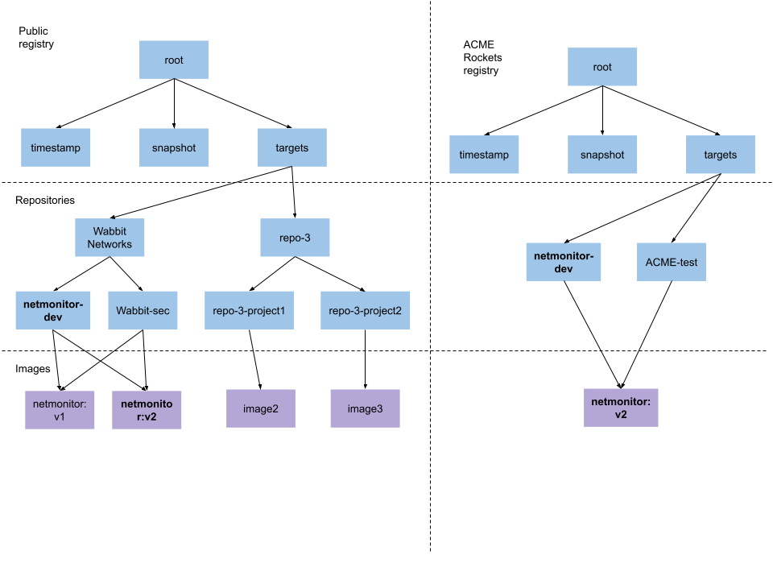

# Notary V2 (nv2) TUF Prototype

## Workflow overview

In this scenario, based on scenarios in the [requirements](https://github.com/notaryproject/requirements/blob/main/scenarios.md#scenarios), Wabbit Networks builds the netmonitor software and publishes it to a public registry.
ACME Rockets consumes this software into their private registry and deploys it to users.
The following is how TUF handles this scenario.

1. Wabbit Networks would perform their usual build process to generate
netmonitor artifacts (OCI Image, SBoM, src, OCI Index).
1. To sign the artifacts, they would run:
`nv2 sign netmonitor wabbit-networks-key`, which uses the netmonitor key
delegated from the Wabbit Network targets key to sign targets metadata about
all artifacts.
1. To upload the artifact, they would run:
`nv2 upload netmonitor`, which uploads artifacts and targets metadata to the
public registry.
[NOTE: if organization root, the next step is done by Wabbit Networks]
The public registry runs an automated process at intervals that adds the new
targets metadata to the snapshot, timestamp metadata hosted on the registry.
1. ACME Rockets consumes netmonitor by running
`nv2 download netmonitor`, which downloads targets metadata and artifacts from
the public registry and verifies the metadata. At this stage, ACME Rockets may
perform any additional validation
1. ACME Rockets adds their signature to targets metadata about netmonitor
(using a key delegated by the targets role on their private registry) by running `nv2 sign netmonitor acme-rockets-key`
1. ACME Rockets uploads targets metadata and artifacts to private registry by
running
`nv2 upload netmonitor`
Their registry then runs an automated process that updates timestamp and
snapshot metadata.
1. The user, which is configured to use only ACME Rockets root and download
from ACME Rockets runs
`nv2 download netmonitor`

In addition to the above scenario, the diagram illustrates how Wabbit Networks could require both the dev and security teams to agree on image contents through the use of multi-role delegations.
