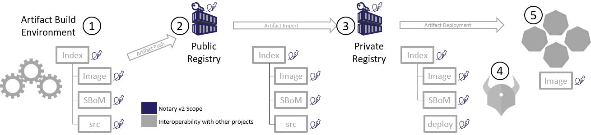
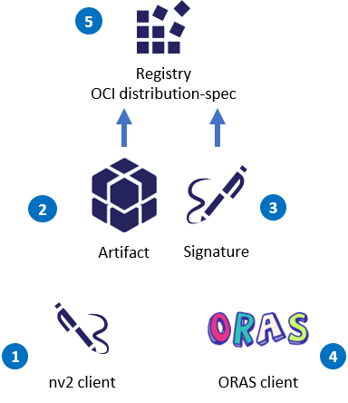

# Notary V2 (nv2) - Prototype

nv2 is an incubation and prototype for the [Notary v2][notary-v2] efforts, securing artifacts stored in [distribution-spec][distribution-spec] based registries.
The `nv2` prototype covers the scenarios outlined in [notaryproject/requirements](https://github.com/notaryproject/requirements/blob/master/scenarios.md#scenarios). It also follows the [prototyping approach described here](https://github.com/stevelasker/nv2#prototyping-approach).



To enable the above workflow:

- The nv2 client (1) will sign any OCI artifact type (2) (including a Docker Image, Helm Chart, OPA, SBoM or any OCI Artifact type), generating a Notary v2 signature (3)
- The [ORAS][oras] client (4) can then push the artifact (2) and the Notary v2 signature (3) to an OCI Artifacts supported registry (5)
- In a subsequent prototype, signatures may be retrieved from the OCI Artifacts supported registry (5)



## Table of Contents

1. [Scenarios](#scenarios)
1. [nv2 signature spec](./docs/signature/README.md)
1. [nv2 signing and verification docs](docs/nv2/README.md)
1. [OCI Artifact schema for storing signatures](docs/artifact/README.md)
1. [nv2 prototype scope](#prototype-scope)

## Scenarios

The current implementation focuses on x509 cert based signatures. Using this approach, the digest and references block are signed, with the cert Common Name required to match the registry references. This enables both the public registry and private registry scenarios.

### Public Registry

Public registries generally have two cateogires of content:

1. Public, certified content. This content is scanned, certified and signed by the registry that wishes to claim the content is "certified". It may be additionaly signed by the originating vendor.
2. Public, community driven content. Community content is a choice for the consumer to trust (downloading their key), or accept as un-trusted.

#### End to End Experience

The user works for ACME Rockets. They build `FROM` and use certified content from docker hub.  
Their environemt is configured to only trust content from `docker.io` and `acme-rockets.io`

#### Public Certified Content

1. The user discovers some certified content they wish to acquire
1. The user copies the URI for the content, passing it to the docker cli
   - `docker run docker.io/hello-world:latest`
1. The user already has the `docker.io` certificate, enabling all certified content from docker hub
1. The image runs, as verification passes

#### Public non-certified content

1. The user discovers some community content they wish to acquire, such as a new network-monitor project
1. The user copies the URI for the content, passing it to the docker cli
   - `docker run docker.io/wabbit-networks/net-monitor:latest`
1. The image fails to run as the user has `trust-required` enabled, and doesn't have the wabbit-networks key.The docker cli produces an error with a url for acquiring the wabbit-networks key.
   - The user can disable `trust-requried`, or acquire the required key.
1. The user acquires the wabbit-networks key, saves it in their local store
1. The user again runs:  
   - `docker run docker.io/wabbit-networks/net-monitor:latest`  
   and the image is sucessfully run

### Key acquisition

*TBD by the key-management working group*

### Private Registry

Private registries serve the follwing scenarios:

- Host public content, ceritifed for use within an orgnization
- Host privately built content, containing the intellectual property of the orgnization.


```json
{
  "signed": {
      "exp": 1626938793,
      "nbf": 1595402793,
      "iat": 1595402793,
      "digest": "sha256:3351c53952446db17d21b86cfe5829ae70f823aff5d410fbf09dff820a39ab55",
      "size": 528,
      "references": [
          "registry.acme-rockets.io/hello-world:latest",
          "registry.acme-rockets.io/hello-world:v1.0"
      ]
  },
    "signatures": [
        {
            "typ": "x509",
  ...
```

## Prototype Scope

- Client
  - CLI experience
    - Signing
    - Verification
  - Binaries plug-in
    - Actual pull / push should be done by external binaries
- Server
  - Access control
  - HTTP API changes
  - Registry storage changes

Key management is offloaded to the underlying signing tools.

[distribution-spec]:    https://github.com/opencontainers/distribution-spec
[notary-v2]:            http://github.com/notaryproject/
[oras]:                 https://github.com/deislabs/oras