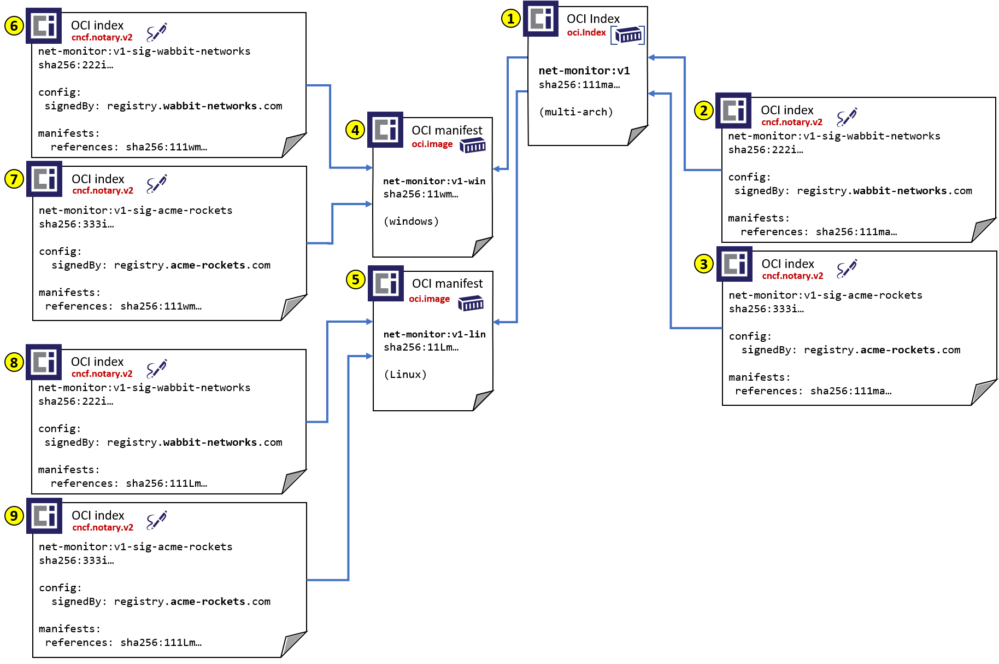

# OCI Distribution

To support [Notary v2 goals][notaryv2-goals], upload, persistence and discovery of signatures must be supported. Alternative designs were considered, as referenced in [persistance-discovery-options.md](./persistance-discovery-options.md).

This document represents the current working prototype which:

- Leverages [OCI Index][oci-index] to store Notary v2 Signatures
- Implements `index.config` to align with the [OCI Artifacts][oci-artifacts] approach for artifact type differentiation within a registry.
- Implements a referrer API to identify referenced artifacts. Such as what signatures refer to a specific container image.

## Table of Contents

- [Signature Persistence](#signature-persistence)
- [Signature Discovery](#signature-discovery)
- [Persisting Referrer Metadata (Signatures)](#persisting-referrer-metadata-signatures)
- [Implementation](#implementation)
- [Push, Discover, Pull Prototype](#push-discover-pull-prototype)

## Signature Persistence

Several [options for how to persist a signature were explored][signature-persistance-options] . We measure these options against the [goals of Notary v2][notaryv2-goals], specifically:

- Maintain the original artifact digest and collection of associated tags, supporting existing dev through deployment workflows
- Multiple signatures per artifact, enabling the originating vendor signature, public registry certification and user/environment signatures
- Native Persistence within an OCI Artifact enabled, distribution spec based registry
- Artifact and signature copying within and across OCI Artifact enabled, distribution spec based registries
- Support multi-tenant registries enabling cloud providers and enterprises to support managed services at scale
- Support private registries, where public content may be copied to, and new content originated within
- Air-gapped environments, where the originating registry of content is not accessible

To support the above requirements, signatures are stored as separate [OCI Artifacts][oci-artifacts], persisted as [OCI Index][oci-index] objects. They are maintained as any other artifact in a registry, supporting standard operations such as listing, deleting, garbage collection and any other content addressable operations within a registry.

Following the [OCI Artifacts][oci-artifacts] design, [Notary v2 signatures][nv2-signature-spec] are identified with: `config.mediaType: "application/vnd.cncf.notary.config.v2+jwt"`.


The above represents the `net-monitor:v1` container image, signed by it's originating author (**wabbit-networks**) as well as **acme-rockets** which imported the image into their private registry.  
The signatures are persisted as OCI Indexes, with a new `index.config` object storing the signature content:

1. **manifest digest for the `net-monitor:v1` image:** `sha256:111ma2d22ae5ef400769fa51c84717264cd1520ac8d93dc071374c1be49a111m"`  

    ```JSON
    {
      "schemaVersion": 2,
      "mediaType": "application/vnd.oci.image.manifest.v2+json",
      "config": {
        "mediaType": "application/vnd.oci.image.config.v1+json",
        "digest": "sha256:111ca3788f3464fd9a06386c4d7a8e3018b525278ac4b9da872943d4cfea111c",
        "size": 1906
      },
      "layers": [
        {
          "mediaType": "application/vnd.oci.image.layer.v1.tar+gzip",
          "digest": "sha256:9834876dcfb05cb167a5c24953eba58c4ac89b1adf57f28f2f9d09af107ee8f0",
          "size": 32654
        },
        {
          "mediaType": "application/vnd.oci.image.layer.v1.tar+gzip",
          "digest": "sha256:ec4b8955958665577945c89419d1af06b5f7636b4ac3da7f12184802ad867736",
          "size": 73109
        }
      ]
    }
    ```

2. **index digest for the wabbit-networks signature** `sha256:222ibbf80b44ce6be8234e6ff90a1ac34acbeb826903b02cfa0da11c82cb222i`

    ```json
    {
      "schemaVersion": 2,
      "mediaType": "application/vnd.oci.image.index.v2+json",
      "config": {
        "mediaType": "application/vnd.cncf.notary.config.v2+jwt",
        "digest": "sha256:222cb130c152895905abe66279dd9feaa68091ba55619f5b900f2ebed38b222c",
        "size": 1906
      },
      "manifests": [
        {
          "mediaType": "application/vnd.oci.image.manifest.v1+json",
          "digest": "sha256:111ma2d22ae5ef400769fa51c84717264cd1520ac8d93dc071374c1be49a111m",
          "size": 7023,
          "platform": {
            "architecture": "ppc64le",
            "os": "linux"
          }
        }
      ]
    }
    ```

    The `index.config` contains the following signature information:

    ```json
    {
        "signed": {
            "mediaType": "application/vnd.oci.image.manifest.v2+json",
            "digest": "sha256:111ma2d22ae5ef400769fa51c84717264cd1520ac8d93dc071374c1be49a111m",
            "size": 528,
            "references": [
                "registry.wabbit-networks.com/net-monitor:v1"
            ],
            "exp": 1627555319,
            "nbf": 1596019319,
            "iat": 1596019319
        },
        "signature": {
            "typ": "x509",
            "sig": "UFqN24K2fLj...",
            "alg": "RS256",
            "x5c": [
                "MIIDszCCApugAwIBAgIUL1anEU/..."
            ]
        }
    }
    ```

3. **index digest for the acme-rockets signature** `sha256:333ic0c33ebc4a74a0a554c86ac2b28ddf3454a5ad9cf90ea8cea9f9e75c333i`

    ```json
    {
      "schemaVersion": 2,
      "mediaType": "application/vnd.oci.image.index.v2+json",
      "config": {
        "mediaType": "application/vnd.cncf.notary.config.v2+jwt",
        "digest": "sha256:333cc44298fc1c149afbf4c8996fb92427ae41e4649b934ca495991b785c333c",
        "size": 1906
      },
      "manifests": [
        {
          "mediaType": "application/vnd.oci.image.manifest.v1+json",
          "digest": "sha256:111ma2d22ae5ef400769fa51c84717264cd1520ac8d93dc071374c1be49a111m",
          "size": 7023,
          "platform": {
            "architecture": "ppc64le",
            "os": "linux"
          }
        }
      ]
    }
    ```

    The `manifest.config` contains the following signature information:

    ```json
    {
        "signed": {
            "mediaType": "application/vnd.oci.image.manifest.v2+json",
            "digest": "sha256:111ma2d22ae5ef400769fa51c84717264cd1520ac8d93dc071374c1be49a111m",
            "size": 528,
            "references": [
                "registry.acme-rockets.com/net-monitor:v1"
            ],
            "exp": 1627555319,
            "nbf": 1596019319,
            "iat": 1596019319
        },
        "signature": {
            "typ": "x509",
            "sig": "UFqN24K2fLj...",
            "alg": "RS256",
            "x5c": [
                "MIIDszCCApugAwIBAgIUL1anEU/..."
            ]
        }
    }
    ```

**Pros with this approach:**

- Utilize the existing `index.manifests` collection for linking artifacts
- Registries that support oci index already have infrastructure for tracking `index.manifests`, including delete operations and garbage collection
- Existing distribution-spec upload APIs are utilized
- Based on the artifact type:  `index.config.mediaType: "application/vnd.cncf.notary.config.v2+jwt"`, a registry may implement role checking to confirm the identity pushing the Notary v2 artifact type has the registries equivalent of a signer role
- As registry operators may offer role checking for different artifact types, Notary v2 Signatures are just one of many types they may want to authorize

**Cons with this approach:**

- OCI index does not yet support the [OCI config descriptor][oci-descriptor]. This would require a schema change to oci-index, with a version bump.
  - This has been a [desired item for OCI Artifacts][oci-artifacts-index] to support other artifact types which would base on Index.

### Signature Persistence - Signing Multi-arch Manifests

Takin the above scenario further, a signature can be associated with an individual manifest, or a signature can be applied to an index. The index could be a multi-arch index (windows & linux), or the index might represent a [CNAB][cnab].

In the below case, the `net-monitor` software is available as windows (`net-monitor:v1-win`) and linux (`net-monitor:v1-lin`) images, as well as a multi-arch index (`net-monitor:v1`)
The platform specific images, and the multi-arch index are all signed by **wabbit-networks** and **acme-rockets**.



- Objects (1-3) are equivalent to above references, with the exception that (1) is changed from a platform specific manifest to a multi-arch index
- Objects (4-5) represent architecture specific manifests for the multi-arch manifest (1)
- Objects (6-9) are Notary v2 signatures by the originating author (**wabbit-networks**) and the consumer (**acme-rockets**)

## Signature Discovery

The [OCI distribution-spec][oci-distribution] describes the action of [pushing content][oci-distribution-push] and [pulling of content][oci-distribution-pull].  Pulling a manifest and the associated layers implies a registry must store some linkage between the manifest and its references to layers and config. There are implied additional references between an [OCI Index][oci-index] and its referenced manifest.

To support the [Notary v2 workflow][notaryv2-workflow], where the system knows of the artifact being referenced (1), but doesn't know what signatures might exist on that artifact (2-3, 6-9), a discovery API is required to return the objects that refer to the target artifact (1).

Similar to pulling of an artifact, the referrer API implies a reverse lookup is possible. Based on a given artifact digest, what other objects are referencing that object.

To generalize discovery, a `referrer-metadata` API is proposed to enable discovery of an referenced objects. To support this reverse lookup prototype, additions are proposed to the Notary v2 fork of the reference implementation [docker/distribution][notaryv2-distribution] through [notaryv2-referrer-api].

A referrer is any registry artifact that has an immutable reference to a manifest. An OCI index is a referrer to each manifest it references. The [OCI image spec][oci-image] does not include a config property for an OCI index and there is no reverse lookup of referrers in docker distribution.

A modified OCI index with an `index.config` property that references a collection of manifests allows us to associate a "type" to the referrer-referenced relationship, where the `index.config.mediaType` = `application/vnd.cncf.notary.config.v2+jwt`.

### referrer-metadata API

```HTTP
`GET http://localhost:5000/v2/net-monitor/manifests/11wma2d22ae5ef400769fa51c84717264cd1520ac8d93dc071374c1be49a11wm/referrer-metadata`
```

Using the diagram above, the `net-monitor:v1` manifest tag (4) has a digest of: `sha256:11wma2d22ae5ef400769fa51c84717264cd1520ac8d93dc071374c1be49a11wm`. When requesting the referenced objects, we see 2 signature objects being returned (wabbit-networks (6) & acme-rockets(7)), and an OCI multi-arch index (1).

The response could be in the following format. Note the additional `config-mediaType` to identify the specific artifact type in the results.

```HTTP
200 OK
Content-Type: application/json
{
  "digest": "sha256:11wma2d22ae5ef400769fa51c84717264cd1520ac8d93dc071374c1be49a11wm",
  "references": [
    {
      "digest": "sha256:222mbbf80b44ce6be8234e6ff90a1ac34acbeb826903b02cfa0da11c82cb222m",
      "mediaType": "application/vnd.oci.image.index.v1+json",
      "size": "1024",
      "config-mediaType": "application/vnd.cncf.notary.config.v2+jwt"
    },
    {
      "digest": "sha256:333mc0c33ebc4a74a0a554c86ac2b28ddf3454a5ad9cf90ea8cea9f9e75c333m",
      "mediaType": "application/vnd.oci.image.index.v1+json",
      "size": "1025",
      "config-mediaType": "application/vnd.cncf.notary.config.v2+jwt"
    },
    {
      "digest": "sha256:111ia2d22ae5ef400769fa51c84717264cd1520ac8d93dc071374c1be49a111i",
      "mediaType": "application/vnd.oci.image.index.v1+json",
      "size": "1025",
      "config-mediaType": "application/vnd.oci.image.index.v1+json"
    }
  ]
}
```

## Persisting Referrer Metadata (Signatures)

The proposal implements a referrer metadata store for manifests that is essentially a reverse-lookup, by `mediaType`, to referrer config objects. For example, when an OCI index is pushed, if it references a config object of media type `application/vnd.cncf.notary.config.v2+jwt`, a link to the config object is recorded in the referrer metadata store of each referenced manifest.

> See [Issue #13](https://github.com/notaryproject/nv2/issues/13) related to persisting manifest or config references.
> See [Artifacts submitted to a registry](https://github.com/notaryproject/nv2/blob/prototype-1/docs/distribution/persistance-discovery-options.md#artifacts-submitted-to-a-registry) for each digest reference in this example.

### Put an OCI index by digest, linking a signature to a collection of manifests

Using the existing [OCI distribution-spec push][oci-distribution-push-manifest] api to push an [OCI index][oci-index] with the added `index.config` to describe the type as Notary v2.

`PUT https://localhost:5000/v2/net-monitor/manifests/sha256:222ibbf80b44ce6be8234e6ff90a1ac34acbeb826903b02cfa0da11c82cb222i`

```json
{
  "schemaVersion": 3,
  "mediaType": "application/vnd.oci.image.index.v1+json",
  "config": {
    "mediaType": "application/vnd.cncf.notary.config.v2+jwt",
    "digest": "sha256:222cb130c152895905abe66279dd9feaa68091ba55619f5b900f2ebed38b222c",
    "size": 1906
  },
  "manifests": [
    {
      "mediaType": "application/vnd.oci.image.manifest.v1+json",
      "digest": "sha256:111ma2d22ae5ef400769fa51c84717264cd1520ac8d93dc071374c1be49a111m",
      "size": 7023,
      "platform": {
        "architecture": "ppc64le",
        "os": "linux"
      }
    }
  ]
}
```

PUT index would result in the creation of a link between the index config object `sha256:222cb130c152895905abe66279dd9feaa68091ba55619f5b900f2ebed38b222c`and the `net-monitor` manifest `sha256:111ma2d22ae5ef400769fa51c84717264cd1520ac8d93dc071374c1be49a111m`, of type `application/vnd.cncf.notary.config.v2+jwt`.

## Implementation

Using [docker-distribution][notaryv2-distribution], backed by file storage, the `net-monitor:v1` image is already persisted:

- repository: `net-monitor`
- digest: `sha256:111ma2d22ae5ef400769fa51c84717264cd1520ac8d93dc071374c1be49a111m`
- tag: `v1.0`

The storage layout is represented as:

```bash
<root>
└── v2
    └── repositories
        └── net-monitor
            └── _manifests
                └── revisions
                    └── sha256
                        └── 111ma2d22ae5ef400769fa51c84717264cd1520ac8d93dc071374c1be49a111m
                            └── link
```

Push a signature artifact and an OCI index that contains a config property referencing the signature:

- signature index digest: `sha256:222ibbf80b44ce6be8234e6ff90a1ac34acbeb826903b02cfa0da11c82cb222i`
- index json:
    ```json
    {
        "schemaVersion": 3,
        "mediaType": "application/vnd.oci.image.index.v1+json",
        "config": {
            "mediaType": "application/vnd.cncf.notary.config.v2+jwt",
            "digest": "sha256:222cb130c152895905abe66279dd9feaa68091ba55619f5b900f2ebed38b222c",
            "size": 1906
        },
        "manifests": [
            {
              "mediaType": "application/vnd.oci.image.manifest.v1+json",
              "digest": "sha256:111ma2d22ae5ef400769fa51c84717264cd1520ac8d93dc071374c1be49a111m",
              "size": 7023,
              "platform": {
                "architecture": "ppc64le",
                "os": "linux"
              }
            }
        ]
    }
    ```

Consistent with the current distribution implementation, on `PUT` the index appears as a manifest revision. 

The Notary v2 prototype adds referrer metadata for the **wabbit-networks** signature:

```
<root>
└── v2
    └── repositories
        └── net-monitor
            └── _manifests
                └── revisions
                    └── sha256
                        ├── 111ma2d22ae5ef400769fa51c84717264cd1520ac8d93dc071374c1be49a111m
                        │   ├── link
                        │   └── referrerMetadata
                        │       └── application/vnd.cncf.notary.config.v2+jwt
                        │           └── sha256
                        │               └── 222cb130c152895905abe66279dd9feaa68091ba55619f5b900f2ebed38b222c
                        │                   └── link
                        └── 222ibbf80b44ce6be8234e6ff90a1ac34acbeb826903b02cfa0da11c82cb222i
                            └── link
```

Adding the **acme-rockets** signature:

- signature index digest: `sha256:333ic0c33ebc4a74a0a554c86ac2b28ddf3454a5ad9cf90ea8cea9f9e75c333i`
- index json:

  ```json
  {
    "schemaVersion": 3,
    "mediaType": "application/vnd.oci.image.index.v1+json",
    "config": {
      "mediaType": "application/vnd.cncf.notary.config.v2+jwt",
      "digest": "sha256:333cc44298fc1c149afbf4c8996fb92427ae41e4649b934ca495991b785c333c",
      "size": 1906
    },
    "manifests": [
      {
        "mediaType": "application/vnd.oci.image.manifest.v1+json",
        "digest": "sha256:111ma2d22ae5ef400769fa51c84717264cd1520ac8d93dc071374c1be49a111m",
        "size": 7023,
        "platform": {
          "architecture": "ppc64le",
          "os": "linux"
        }
      }
    ]
  }
  ```

The Notary v2 storage layout of 2 signature index objects:

```
<root>
└── v2
    └── repositories
        └── net-monitor
            └── _manifests
                └── revisions
                    └── sha256
                        ├── 111ma2d22ae5ef400769fa51c84717264cd1520ac8d93dc071374c1be49a111m
                        │   ├── link
                        │   └── referrerMetadata
                        │       └── application/vnd.cncf.notary.config.v2+jwt
                        │           └── sha256
                        │               ├── 222cb130c152895905abe66279dd9feaa68091ba55619f5b900f2ebed38b222c
                        │               │    └── link
                        │               └── 333cc44298fc1c149afbf4c8996fb92427ae41e4649b934ca495991b785c333c
                        │                   └── link
                        ├── 222ibbf80b44ce6be8234e6ff90a1ac34acbeb826903b02cfa0da11c82cb222i
                        │   └── link
                        └── 333ic0c33ebc4a74a0a554c86ac2b28ddf3454a5ad9cf90ea8cea9f9e75c333i
                            └── link
```

## Push, Discover, Pull Prototype

Available here: https://github.com/notaryproject/distribution/tree/prototype-1

The following steps illustrate how signatures can be stored and retrieved from a registry.

### Prerequisites

- Local registry prototype instance
- [docker-generate](https://github.com/shizhMSFT/docker-generate)
- [nv2](https://github.com/notaryproject/nv2)
- `curl`
- `jq`
- `python3`

### Push an image to your registry

```shell
# Local registry
regIp="127.0.0.1" && \
  regPort="5000" && \
  registry="$regIp:$regPort" && \
  repo="busybox" && \
  tag="latest" && \
  image="$repo:$tag" && \
  reference="$registry/$image"

# Pull image from docker hub and push to local registry
docker pull $image && \
  docker tag $image $reference && \
  docker push $reference
```

### Generate image manifest and sign it

```shell
# Generate self-signed certificates
openssl req \
  -x509 \
  -sha256 \
  -nodes \
  -newkey rsa:2048 \
  -days 365 \
  -subj "/CN=$regIp/O=example inc/C=IN/ST=Haryana/L=Gurgaon" \
  -addext "subjectAltName=IP:$regIp" \
  -keyout example.key \
  -out example.crt

# Generate image manifest
manifestFile="manifest-to-sign.json" && \
  docker generate manifest $image > $manifestFile

# Sign manifest
signatureFile="manifest-signature.jwt" && \
  nv2 sign --method x509 \
    -k example.key \
    -c example.crt \
    -r $reference \
    -o $signatureFile \
    file:$manifestFile
```

### Obtain manifest and signature digests

```shell
manifestDigest="sha256:$(sha256sum $manifestFile | cut -d " " -f 1)" && \
  signatureDigest="sha256:$(sha256sum $signatureFile | cut -d " " -f 1)"
```

### Create an OCI index file referencing the manifest that was signed and its signature as config

```shell
indexFile="index.json" && \
  indexMediaType="application/vnd.oci.image.index.v1+json" && \
  configMediaType="application/vnd.cncf.notary.config.v2+jwt" && \
  signatureFileSize=`wc -c < $signatureFile` && \
  manifestMediaType="$(cat $manifestFile | jq -r '.mediaType')" && \
  manifestFileSize=`wc -c < $manifestFile`

cat <<EOF > $indexFile
{
  "schemaVersion": 3,
  "mediaType": "$indexMediaType",
  "config": {
    "mediaType": "$configMediaType",
    "digest": "$signatureDigest",
    "size": $signatureFileSize
  },
  "manifests": [
    {
      "mediaType": "$manifestMediaType",
      "digest": "$manifestDigest",
      "size": $manifestFileSize
    }
  ]
}
EOF
```

### Obtain index digest

```shell
indexDigest="sha256:$(sha256sum $indexFile | cut -d " " -f 1)"
```

### Push signature and index

```shell
# Initiate blob upload and obtain PUT location
configPutLocation=`curl -I -X POST -s http://$registry/v2/$repo/blobs/uploads/ | grep "Location: " | sed -e "s/Location: //;s/$/\&digest=$signatureDigest/;s/\r//"`

# Push signature blob
curl -X PUT -H "Content-Type: application/octet-stream" --data-binary @"$signatureFile" $configPutLocation

# Push index
curl -X PUT --data-binary @"$indexFile" -H "Content-Type: $indexMediaType" "http://$registry/v2/$repo/manifests/$indexDigest"
```

### Retrieve signatures of a manifest as referrer metadata

```shell
# URL encode index config media type
metadataMediaType=`python3 -c "import urllib.parse, sys; print(urllib.parse.quote(sys.argv[1]))" $configMediaType`

# Retrieve referrer metadata
curl -s "http://$registry/v2/$repo/manifests/$manifestDigest/referrer-metadata?media-type=$metadataMediaType" | jq
```

### Verify signature

```shell
# Retrieve first signature and store it locally
metadataDigest=`curl -s "http://$registry/v2/$repo/manifests/$manifestDigest/referrer-metadata?media-type=$metadataMediaType" | jq -r '.referrerMetadata[0]'` && \
  retrievedMetadataFile="retrieved-signature.jwt" && \
  curl -s http://$registry/v2/$repo/blobs/$metadataDigest > $retrievedMetadataFile

# Verify signature
nv2 verify \
  -f $retrievedMetadataFile \
  -c example.crt \
  file:$manifestFile
```

[cnab]:                       https://cnab.io
[notaryv2-goals]:             https://github.com/notaryproject/requirements/blob/52c1ba2f5696a98b317aff84288d3564b4041ad5/README.md#goals
[notaryv2-workflow]:          https://github.com/notaryproject/nv2#notary-v2-nv2---prototype
[notaryv2-distribution]:      https://github.com/notaryproject/distribution
[notaryv2-referrer-api]:      https://github.com/notaryproject/distribution/pull/2
[oci-artifacts]:              https://github.com/opencontainers/artifacts
[oci-artifacts-index]:        https://github.com/opencontainers/artifacts/issues/25
[oci-descriptor]:             https://github.com/opencontainers/image-spec/blob/master/descriptor.md
[oci-distribution]:           https://github.com/opencontainers/distribution-spec
[oci-distribution-pull]:      https://github.com/opencontainers/distribution-spec/blob/master/spec.md#pull
[oci-distribution-push]:      https://github.com/opencontainers/distribution-spec/blob/master/spec.md#push
[oci-distribution-push-manifest]: https://github.com/opencontainers/distribution-spec/blob/master/spec.md#pushing-manifests
[oci-image]:                  https://github.com/opencontainers/image-spec
[oci-index]:                  https://github.com/opencontainers/image-spec/blob/master/image-index.md
[signature-persistance-options]: ./persistance-discovery-options.md
[nv2-signature-spec]:         ../signature/README.md
