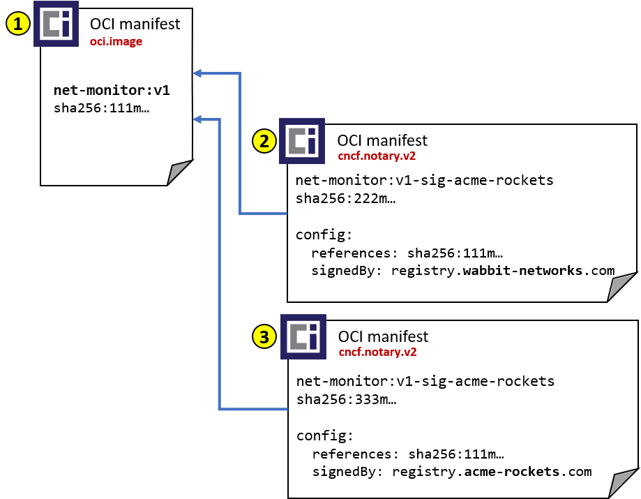
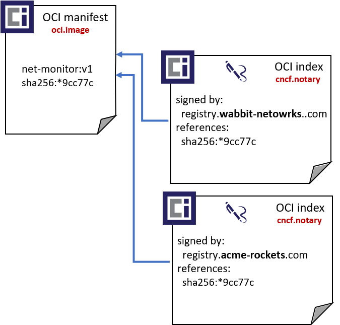
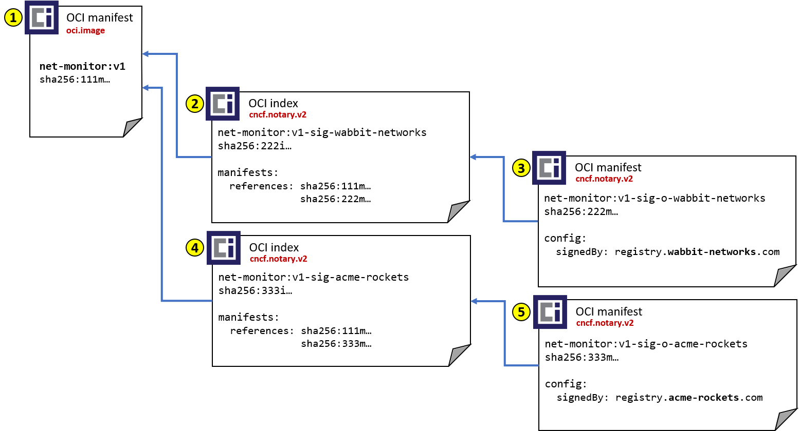

# OCI Distribution - Notary v2 Signature Support

To support [Notary v2 goals][notaryv2-goals], upload, persistance and discovery of signatures must be supported.

To minimize the complexity of registry operators and projects to adopt Notary v2, a balance between leveraging what already exists and new patterns to support secure discovery are explored.

## Table of Contents

* [Signature Persistance](#signature-persistance)
* [Signature Push](#signature-push)
* [Signature Discovery](#signature-discovery)
* [Signature Pull](#signature-pull)
* [Example Artifacts](#example-artifacts)

## Signature Persistance

Several options for how to persist a signature were explored. We measure these options against the [goals of Notary v2][notaryv2-goals], specifically:

* Maintain the original artifact digest and collection of associated tags, supporting existing dev through deployment workflows
* Multiple signatures per artifact, enabling the originating vendor signature, public registry certification and user/environment signatures
* Native persistance within an OCI Artifact enabled, distribution*spec based registry
* Artifact and signature copying within and across OCI Artifact enabled, distribution spec based registries
* Support multi-tenant registries enabling cloud providers and enterprises to support managed services at scale
* Support private registries, where public content may be copied to, and new content originated within
* Air-gapped environments, where the originating registry of content is not accessible

To support the above requirements, signatures are stored as separate [OCI Artifacts][oci-artifacts]. They are maintained as any other artifact in a registry, supporting standard operations such as listing, deleting, garbage collection and any other content addressable operations within a registry.

Following the [OCI Artifacts][oci-artifacts] design, signatures are identified with: `config.mediaType: "application/vnd.cncf.notary.config.v2+jwt"`.
The config object contains the signature and signed content. See [nv2-signature-spec][nv2-signature-spec] for details.

Storing a signature as a separate artifact enables the above goals, most importantly the ability to maintain the existing tag and and digest for a given artifact.

### Persistance as Manifest or Index

A typical signing workflow would involve:

1. An artifact (`net-monitor:v1` container image) is pushed to a registry
1. Signature artifacts are pushed to the same registry using a set of new [OCI distribution][oci-distribution] capabilities

It's presumed artifact clients like docker, oras, buildkit would support these new workflows. The question is what oci schema they are pushed with:

* [Option 1: oci-manifest](#signature-persistance---option-1-oci-manifest)
* [Option 2: oci-index](#signature-persistance---option-2-oci-index)
* [Option 3: oci-manifest-linked through index](#signature-persistance---option-3-oci-manifest-linked-through-oci-index)

### Signature Persistance - Option 1: oci-manifest

The challenge with using oci-manifest is how the registry tracks the linkage between the signature and the original artifact.



Example **manifests** for a container image (`net-monitor:v1`) and two signatures (**wabbit-networks**, **acme-rockets**):

1. **manifest digest for the `net-monitor:v1` image:** `sha256:111ma2d22ae5ef400769fa51c84717264cd1520ac8d93dc071374c1be49a111m"`  
    ```JSON
    {
      "schemaVersion": 2,
      "mediaType": "application/vnd.oci.image.manifest.v2+json",
      "config": {
        "mediaType": "application/vnd.oci.image.config.v1+json",
        "digest": "sha256:111ca3788f3464fd9a06386c4d7a8e3018b525278ac4b9da872943d4cfea111c",
        "size": 1906
      },
      "layers": [
        {
          "mediaType": "application/vnd.oci.image.layer.v1.tar+gzip",
          "digest": "sha256:9834876dcfb05cb167a5c24953eba58c4ac89b1adf57f28f2f9d09af107ee8f0",
          "size": 32654
        },
        {
          "mediaType": "application/vnd.oci.image.layer.v1.tar+gzip",
          "digest": "sha256:ec4b8955958665577945c89419d1af06b5f7636b4ac3da7f12184802ad867736",
          "size": 73109
        }
      ]
    }
    ```
2. **manifest digest for the wabbit-networks signature** `sha256:222mbbf80b44ce6be8234e6ff90a1ac34acbeb826903b02cfa0da11c82cb222m`
    ```json
    {
      "schemaVersion": 2,
      "mediaType": "application/vnd.oci.image.manifest.v2+json",
      "config": {
        "mediaType": "application/vnd.cncf.notary.config.v2+jwt",
        "digest": "sha256:222cb130c152895905abe66279dd9feaa68091ba55619f5b900f2ebed38b222c",
        "size": 1906
      },
      "layers": []
    }
    ```
3. **manifest digest for the acme-rockets signature** `sha256:333mc0c33ebc4a74a0a554c86ac2b28ddf3454a5ad9cf90ea8cea9f9e75c333m`
    ```json
    {
      "schemaVersion": 2,
      "mediaType": "application/vnd.oci.image.manifest.v2+json",
      "config": {
        "mediaType": "application/vnd.cncf.notary.config.v2+jwt",
        "digest": "sha256:333cc44298fc1c149afbf4c8996fb92427ae41e4649b934ca495991b785c333c",
        "size": 1906
      },
      "layers": []
    }
    ```

**Pros with this approach:**

* OCI Artifacts already supports manifest based artifacts, through the `manifest.config.mediaType`

**Cons with this approach:**

* Manifests have no means to reference other artifacts.
* An alternative is required to link a target artifact with it's signature. Either through parsing the signature `manifest.config` object, or [a separate API for linking objects](#linking-signatures-to-artifacts).

### Signature Persistance - Option 2: oci-index

This option is similar to using oci-manifest. However, instead of parsing the signature object to determine the linkage between an artifact and signature, the `index.manifests` collection is utilized.



Example **manifests** for a container image (`net-monitor:v1`) and two signatures (**wabbit-networks**, **acme-rockets**). The signatures are persisted as OCI Indexes, with a new `index.config` object:

1. **manifest digest for the `net-monitor:v1` image:** `sha256:111ma2d22ae5ef400769fa51c84717264cd1520ac8d93dc071374c1be49a111m"`  
    ```JSON
    {
      "schemaVersion": 2,
      "mediaType": "application/vnd.oci.image.manifest.v2+json",
      "config": {
        "mediaType": "application/vnd.oci.image.config.v1+json",
        "digest": "sha256:111ca3788f3464fd9a06386c4d7a8e3018b525278ac4b9da872943d4cfea111c",
        "size": 1906
      },
      "layers": [
        {
          "mediaType": "application/vnd.oci.image.layer.v1.tar+gzip",
          "digest": "sha256:9834876dcfb05cb167a5c24953eba58c4ac89b1adf57f28f2f9d09af107ee8f0",
          "size": 32654
        },
        {
          "mediaType": "application/vnd.oci.image.layer.v1.tar+gzip",
          "digest": "sha256:ec4b8955958665577945c89419d1af06b5f7636b4ac3da7f12184802ad867736",
          "size": 73109
        }
      ]
    }
    ```
2. **index digest for the wabbit-networks signature** `sha256:222ibbf80b44ce6be8234e6ff90a1ac34acbeb826903b02cfa0da11c82cb222i`
    ```json
    {
      "schemaVersion": 2,
      "mediaType": "application/vnd.oci.image.index.v2+json",
      "config": {
        "mediaType": "application/vnd.cncf.notary.config.v2+jwt",
        "digest": "sha256:222cb130c152895905abe66279dd9feaa68091ba55619f5b900f2ebed38b222c",
        "size": 1906
      },
      "manifests": [
        {
          "mediaType": "application/vnd.oci.image.manifest.v1+json",
          "digest": "sha256:111ma2d22ae5ef400769fa51c84717264cd1520ac8d93dc071374c1be49a111m",
          "size": 7023,
          "platform": {
            "architecture": "ppc64le",
            "os": "linux"
          }
        }
      ]
    }
    ```
3. **index digest for the acme-rockets signature** `sha256:333ic0c33ebc4a74a0a554c86ac2b28ddf3454a5ad9cf90ea8cea9f9e75c333i`
    ```json
    {
      "schemaVersion": 2,
      "mediaType": "application/vnd.oci.image.index.v2+json",
      "config": {
        "mediaType": "application/vnd.cncf.notary.config.v2+jwt",
        "digest": "sha256:333cc44298fc1c149afbf4c8996fb92427ae41e4649b934ca495991b785c333c",
        "size": 1906
      },
      "manifests": [
        {
          "mediaType": "application/vnd.oci.image.manifest.v1+json",
          "digest": "sha256:111ma2d22ae5ef400769fa51c84717264cd1520ac8d93dc071374c1be49a111m",
          "size": 7023,
          "platform": {
            "architecture": "ppc64le",
            "os": "linux"
          }
        }
      ]
    }
    ```

**Pros with this approach:**

* Utilize the existing `index.manifests` collection for linking artifacts
* Registries that support oci index already have infrastructure for tracking `index.manifests`, including delete operations and garbage collection
* Existing distribution-spec upload APIs are utilized
* Unlike the manifest proposal, no additional artifact handler would be required to parse the config object for linking artifacts
* Based on the artifact type:  `manifest.config.mediaType: "application/vnd.cncf.notary.config.v2+jwt"`, role check may be done to confirm the identity has a signer role
* As registry operators may offer role checking for different artifact types, Notary v2 Signatures are just one of many types they may want to authorize

**Cons with this approach:**

* OCI index does not yet support the [OCI config descriptor][oci-descriptor]. This would require a schema change to oci-index, with a version bump.
  * This has been a [desired item for OCI Artifacts][oci-artifacts-index] to support other artifact types which would base on Index.
* An additional role check is performed, based on the artifact type. Also noted as a pro as registry operators may want to utilize this for other artifact types, making it a consistent model.

> **Note:** this is our working/preferred method: See OCI image-spec issue: [Add Index Support for Artifact Type #806](https://github.com/opencontainers/image-spec/issues/806)

### Signature Persistance - Option 3: oci-manifest linked through oci-index

This model is a hybrid of the 1 & 2, but moves the persistance of the signature from the config object to a layer of an additional manifest.



1. **manifest digest for the `net-monitor:v1` image:** `sha256:111ma2d22ae5ef400769fa51c84717264cd1520ac8d93dc071374c1be49a111m"`  
    ```JSON
    {
      "schemaVersion": 2,
      "mediaType": "application/vnd.oci.image.manifest.v2+json",
      "config": {
        "mediaType": "application/vnd.oci.image.config.v1+json",
        "digest": "sha256:111ca3788f3464fd9a06386c4d7a8e3018b525278ac4b9da872943d4cfea111c",
        "size": 1906
      },
      "layers": [
        {
          "mediaType": "application/vnd.oci.image.layer.v1.tar+gzip",
          "digest": "sha256:9834876dcfb05cb167a5c24953eba58c4ac89b1adf57f28f2f9d09af107ee8f0",
          "size": 32654
        },
        {
          "mediaType": "application/vnd.oci.image.layer.v1.tar+gzip",
          "digest": "sha256:ec4b8955958665577945c89419d1af06b5f7636b4ac3da7f12184802ad867736",
          "size": 73109
        }
      ]
    }
    ```
2. **index digest for the wabbit-networks signature** `sha256:222ibbf80b44ce6be8234e6ff90a1ac34acbeb826903b02cfa0da11c82cb222i`
    ```json
    {
      "schemaVersion": 2,
      "mediaType": "application/vnd.oci.image.index.v2+json",
      "config": {
        "mediaType": "application/vnd.cncf.notary.config.v2+jwt",
        "digest": "sha256:222cb130c152895905abe66279dd9feaa68091ba55619f5b900f2ebed38b222c",
        "size": 1906
      },
      "manifests": [
        {
          "mediaType": "application/vnd.oci.image.manifest.v1+json",
          "digest": "sha256:111ma2d22ae5ef400769fa51c84717264cd1520ac8d93dc071374c1be49a111m",
          "size": 7023,
          "platform": {
            "architecture": "ppc64le",
            "os": "linux"
          }
        },
        {
          "mediaType": "application/vnd.oci.image.manifest.v1+json",
          "digest": "sha256:222mbbf80b44ce6be8234e6ff90a1ac34acbeb826903b02cfa0da11c82cb222m",
          "size": 7023,
          "config_mediaType": "application/vnd.cncf.notary.config.v2+jwt"
        }
      ]
    }
    ```
3. **manifest digest for the wabbit-networks signature** `sha256:222mbbf80b44ce6be8234e6ff90a1ac34acbeb826903b02cfa0da11c82cb222m`
    ```json
    {
      "schemaVersion": 2,
      "mediaType": "application/vnd.oci.image.manifest.v2+json",
      "config": {
        "mediaType": "application/vnd.cncf.notary.config.v2+jwt",
        "digest": "sha256:222cb130c152895905abe66279dd9feaa68091ba55619f5b900f2ebed38b222c",
        "size": 1906
      },
      "layers": []
    }
    ```
4. **index digest for the acme-rockets signature** `sha256:333ic0c33ebc4a74a0a554c86ac2b28ddf3454a5ad9cf90ea8cea9f9e75c333i`
    ```json
    {
      "schemaVersion": 2,
      "mediaType": "application/vnd.oci.image.index.v2+json",
      "config": {
        "mediaType": "application/vnd.cncf.notary.config.v2+jwt",
        "digest": "sha256:333cc44298fc1c149afbf4c8996fb92427ae41e4649b934ca495991b785c333c",
        "size": 1906
      },
      "manifests": [
        {
          "mediaType": "application/vnd.oci.image.manifest.v1+json",
          "digest": "sha256:111ma2d22ae5ef400769fa51c84717264cd1520ac8d93dc071374c1be49a111m",
          "size": 7023,
          "platform": {
            "architecture": "ppc64le",
            "os": "linux"
          }
        },
        {
          "mediaType": "application/vnd.oci.image.manifest.v1+json",
          "digest": "sha256:333mbbf80b44ce6be8234e6ff90a1ac34acbeb826903b02cfa0da11c82cb333m",
          "size": 7023,
          "config_mediaType": "application/vnd.cncf.notary.config.v2+jwt"
          }
        }
      ]
    }
5. **manifest digest for the acme-rockets signature** `sha256:333mc0c33ebc4a74a0a554c86ac2b28ddf3454a5ad9cf90ea8cea9f9e75c333m`
    ```json
    {
      "schemaVersion": 2,
      "mediaType": "application/vnd.oci.image.manifest.v2+json",
      "config": {
        "mediaType": "application/vnd.cncf.notary.config.v2+jwt",
        "digest": "sha256:333cc44298fc1c149afbf4c8996fb92427ae41e4649b934ca495991b785c333c",
        "size": 1906
      },
      "layers": []
    }
    ```

**Pros with this approach:**

* Conforms to norms of indexes as collections of manifests with no config data

**Cons with this approach:**

* An additional indirection between the original artifact being signed and the individual signatures.
* An `index.config.mediaType` is still required to identify the type of index being something other than a multi-arch index.

The implied benefit is the signature is moved from the `index.config` to a layer within a manifest. However, config objects are [oci descriptors][oci-descriptor] pointing to blobs. Whether the signature is stored within a config or a layer is little difference. Since we'll need an `index.config.mediaType` to differentiate a signature index from a multi-arch index, are we justifying additional round trips to get a list of signatures?

## Linking Signatures to Artifacts

A signature is only interesting if it's linked to the object it's signing. The question is how.

If manifest is used, we must choose between options 1-3.
If index is used, option 4 defers the linking to existing Index linking capabilities

1. [Option 1: Parse the config object](#linking-signatures---option-1-parse-the-config-object)
1. [Option 2: Distinct Linking API](#linking-signatures---option-2-distinct-linking-api)
1. [Option 3: Signature Upload API](#linking-signatures---option-3-signature-upload-api)
1. [Option 4: Utilize OCI Index PUT](#linking-signatures---option-4-utilize-oci-index-put)

### Linking Signatures - Option 1: Parse the config object

Upon [manifest put][oci-dist-spec-manifest-put], perform the following steps:

* The [proposed nv2 signature specification][nv2-signature-spec] identifies the referenced artifact by its digest and optional tags.
* As the registry receives artifacts, the artifact type is parsed, evaluating the `manifest.config.mediaType` of `"application/vnd.cncf.notary.config.v2+jwt"`
* A role check is performed, confirming the identity of the PUT has **signer** rights
* The registry uses the config objects reference to link the signature with signed digest. This would enable registry tracking for garbage collection

Partial config object, referring to the digest and tag of the `net-monitor:v1` container image:

```json
{
  "signed": {
    "mediaType": "application/vnd.oci.image.manifest.v2+json",
    "digest": "sha256:2235d2d22ae5ef400769fa51c84717264cd1520ac8d93dc071374c1be49cc77c",
    "size": 528,
    "references": [
      "registry.acme-rockets.com/net-monitor:v1"
    ]
```

**Pros with this approach:**

* Existing [distribution-spec manifest put APIs][oci-dist-spec-manifest-put] are utilized for the manifest PUT
* Rather than add a new linking API, an artifact handler would be added to registries. Many already parse the config objects to understand which platform and architectures they support.

**Cons with this approach:**

* An artifact handler is required that  must parse the signature object for the linked artifact
* New code for tracking dependency linking is required through a config object handler
* Based on the unique artifact type:  `manifest.config.mediaType: "application/vnd.cncf.notary.config.v2+jwt"`, a role check may be done to confirm the identity has a signer role.

### Linking Signatures - Option 2: Distinct Linking API

Similar to the manifest or index options, the client pushes the artifact and signatures through standard oci-distribution PUT apis.
However, no linkage is made between the signature object and the signed artifact. Rather a signature linking api is added:

1. Push all artifacts to the registry:  
   * Push `net-monitor:v1` container image: `sha256:2235d2d22ae5ef400769fa51c84717264cd1520ac8d93dc071374c1be49cc77c`
   * Push **acme-rockets** signature artifact `sha256:007170c33ebc4a74a0a554c86ac2b28ddf3454a5ad9cf90ea8cea9f9e75a153b`
1. Link **acme-rockets** signature to the `net-monitor:v1` container image

```HTTP
PUT https://localhost:6000/v2/net-monitor/manifests/sha256:2235d2d22ae5ef400769fa51c84717264cd1520ac8d93dc071374c1be49cc77c/signatures/sha256:007170c33ebc4a74a0a554c86ac2b28ddf3454a5ad9cf90ea8cea9f9e75a153b
```

**Pros with this approach:**

* Using a unique API enables RBAC to the API, without having to parse the content to determine the role check.

**Cons with this approach:**

* A new linking api, unique to signatures
* The client must make two calls to achieve a single operation of uploading a signature object, which by definition has the linking information
* If the signature linking API fails, additional garbage collection of a signature manifest must be cleaned up

### Linking Signatures - Option 3: Signature Upload API

In this option the signature artifact (manifest or index) is uploaded through a new signature API.

**Pros with this approach:**

* The signature artifact upload and role check are coupled to a signature API

**Cons with this approach:**

* Signature upload, which is just another artifact type, is uploaded differently than other artifacts.

### Linking Signatures - Option 4: Utilize OCI Index PUT

Utilizing the OCI Index, the manifest list is used to track dependencies.

**Pros with this approach:**

* Existing Index parsing logic is used to track despondencies
* No additional distribution-spec APIs are required

**Cons with this approach:**

* OCI Index would need to support a config object:  [Add Index Support for Artifact Type #806](https://github.com/opencontainers/image-spec/issues/)

## Signature Discovery

Once a signature artifact is in a registry and linked to its target artifact, how is it retrieved?

The following options are offered:

1. [Option 1: Signature Listing API](#signature-discovery---option-1-rest-api-standard-paging)
1. [Option 2: Generic Reference Listing API](#signature-discovery---option-2-generic-reference-listing-api)

### Signature Discovery - Option 1: Signature Listing API

Similar to the [_tags api][tags-api], a new signatures API is proposed. The signatures API uses the digest as the path to find all signatures related to said digest.
In the below example, the `net-monitor:v1` tag has a digest of: `sha256:90659bf80b44ce6be8234e6ff90a1ac34acbeb826903b02cfa0da11c82cbc042`

```HTTP
GET /v2/<name>/manifests/sha256:90659bf80b44ce6be8234e6ff90a1ac34acbeb826903b02cfa0da11c82cbc042/signatures/
```

The response will be in the following format:

```HTTP
200 OK
Content-Type: application/json
{
  "digest": "sha256:90659bf80b44ce6be8234e6ff90a1ac34acbeb826903b02cfa0da11c82cbc042",
  "signatures": [
    {
      "digest": "sha256:90659bf80b44ce6be8234e6ff90a1ac34acbeb826903b02cfa0da11c82cbc042",
      "mediaType": "application/vnd.oci.image.index.v1+json",
      "size": "1024",
      "signature-typ": "x509"
    },
    {
      "digest": "sha256:007170c33ebc4a74a0a554c86ac2b28ddf3454a5ad9cf90ea8cea9f9e75a153b",
      "mediaType": "application/vnd.oci.image.index.v1+json",
      "size": "1025",
      "signature-typ": "x509"
    }
  ]
}
```

### Signature Discovery - Option 2: Generic Reference Listing API

A slight alternative to the signatures API is to provide a generic reference listing API, where a paged collection of references are returned.

In the below example, the `net-monitor:v1` tag has a digest of: `sha256:90659bf80b44ce6be8234e6ff90a1ac34acbeb826903b02cfa0da11c82cbc042`

```HTTP
GET /v2/<name>/manifests/sha256:90659bf80b44ce6be8234e6ff90a1ac34acbeb826903b02cfa0da11c82cbc042/references/
```

The response will be in the following format:

```HTTP
200 OK
Content-Type: application/json
{
  "digest": "sha256:90659bf80b44ce6be8234e6ff90a1ac34acbeb826903b02cfa0da11c82cbc042",
  "references": [
    {
      "digest": "sha256:90659bf80b44ce6be8234e6ff90a1ac34acbeb826903b02cfa0da11c82cbc042",
      "mediaType": "application/vnd.oci.image.index.v1+json",
      "size": "1024",
      "config-mediaType": "application/vnd.cncf.notary.config.v2+jwt"
    },
    {
      "digest": "sha256:007170c33ebc4a74a0a554c86ac2b28ddf3454a5ad9cf90ea8cea9f9e75a153b",
      "mediaType": "application/vnd.oci.image.index.v1+json",
      "size": "1025",
      "config-mediaType": "application/vnd.cncf.notary.config.v2+jwt"
    },
    {
      "digest": "sha256:007170c33ebc4a74a0a554c86ac2b28ddf3454a5ad9cf90ea8cea9f9e75a153b",
      "mediaType": "application/vnd.oci.image.index.v1+json",
      "size": "1025",
      "config-mediaType": "application/vnd.oci.image.index.v1+json"
    }
  ]
}
```

### Paging Results

There are three identified patterns for paging results:

1. [OCI distribution-spec Tag Listing](#distribution-spec---tags-listing-api)
1. [Google API Design Guidelines](#google-paging-api)
1. [Microsoft API Design Guidelines](https://github.com/microsoft/api-guidelines/blob/vNext/Guidelines.md#98-pagination)

#### Distribution Spec - Tags Listing API

The [OCI distribution-spec][distribution-spec-paging] identifies paging with `n` and `last` parameters:
[tags-api]

Get a list of paginated signatures from the registry. The response will include an opaque URL that can be followed to obtain the next page of results.

Paginated tag results can be retrieved by adding an `n` parameter to the request URL, declaring that the response SHOULD be limited to `n` results. Starting a paginated flow MAY begin as follows:

```HTTP
GET /v2/<name>/manifests/sha256:90659bf80b44ce6be8234e6ff90a1ac34acbeb826903b02cfa0da11c82cbc042/references/list?n=<integer>
```

The above specifies that a tags response SHOULD be returned, from the start of the result set, ordered lexically, limiting the number of results to `n`. The response to such a request would look as follows:

```HTTP
200 OK
Content-Type: application/json
Link: <<url>?n=<n from the request>&last=<last tag value from previous response>>; rel="next"
{
  "digest": "sha256:90659bf80b44ce6be8234e6ff90a1ac34acbeb826903b02cfa0da11c82cbc042",
  "@nextLink": "{opaqueUrl}",
  "references": [
    {
      "digest": "sha256:90659bf80b44ce6be8234e6ff90a1ac34acbeb826903b02cfa0da11c82cbc042",
      "mediaType": "application/vnd.oci.image.index.v1+json",
      "size": "1024",
      "config-mediaType": "application/vnd.cncf.notary.config.v2+jwt"
    },
    {
      "digest": "sha256:007170c33ebc4a74a0a554c86ac2b28ddf3454a5ad9cf90ea8cea9f9e75a153b",
      "mediaType": "application/vnd.oci.image.index.v1+json",
      "size": "1025",
      "config-mediaType": "application/vnd.cncf.notary.config.v2+jwt"
    },
    {
      "digest": "sha256:007170c33ebc4a74a0a554c86ac2b28ddf3454a5ad9cf90ea8cea9f9e75a153b",
      "mediaType": "application/vnd.oci.image.index.v1+json",
      "size": "1025",
      "config-mediaType": "application/vnd.oci.image.index.v1+json"
    }
  ]
}
```

To get the _next_ `n` entries, one can create a URL where the argument `last` has the value from `references[len(tags)-1]`.
If there are indeed more results, the URL for the next block is encoded in an [RFC5988](https://tools.ietf.org/html/rfc5988) `Link` header, as a "next" relation.

The presence of the `Link` header communicates to the client that the entire result set has not been returned and another request MAY be issued.
If the header is not present, the client can assume that all results have been received.

> __NOTE:__ In the request template above, note that the brackets are required. For example, if the url is `http://example.com/<name>/manifests/sha256:90659bf80b44ce6be8234e6ff90a1ac34acbeb826903b02cfa0da11c82cbc042/references/list?n=20&last=b`, the value of the header would be `http://example.com/<name>/manifests/sha256:90659bf80b44ce6be8234e6ff90a1ac34acbeb826903b02cfa0da11c82cbc042/references/list?n=20&last=b>; rel="next"`.
> Please see [RFC5988](https://tools.ietf.org/html/rfc5988) for details.

Compliant client implementations SHOULD always use the `Link` header value when proceeding through results linearly. The client MAY construct URLs to skip forward in the list of tags.

To get the next result set, a client would issue the request as follows, using the URL encoded in the described `Link` header:

```HTTP
GET /v2/<name>/manifests/sha256:90659bf80b44ce6be8234e6ff90a1ac34acbeb826903b02cfa0da11c82cbc042/references/list?n=<n from the request>&last=<last tag value from previous response>
```

The above process should then be repeated until the `Link` header is no longer set in the response.

The tag list result set is represented abstractly as a lexically sorted list, where the position in that list can be specified by the query term `last`. The entries in the response start _after_ the term specified by `last`, up to `n`
entries.

#### Google Paging API

From [Google API Design Guides][google-paging-api]

To support pagination (returning list results in pages) in a List method, the API shall:

* define `a string` field `page_token` in the `List` method's request message. The client uses this field to request a specific page of the list results.
* define an `int32` field `page_size` in the `List` method's request message. Clients use this field to specify the maximum number of results to be returned by the server. The server **may** further constrain the maximum number of results returned in a single page. If the `page_size` is `0`, the server will decide the number of results to be returned.
* define a `string` field `next_page_token` in the `List` method's response message. This field represents the pagination token to retrieve the next page of results. If the value is `""`, it means no further results for the request.
To retrieve the next page of results, client **shall** pass the value of response's `next_page_token` in the subsequent `List` method call (in the request message's `page_token` field):

```HTTP
GET /v2/<name>/manifests/sha256:90659bf80b44ce6be8234e6ff90a1ac34acbeb826903b02cfa0da11c82cbc042/references/list?page_token=1&page_size=10&next_page_token=<token>
```

The above specifies that a tags response SHOULD be returned, from the start of the result set, ordered lexically, limiting the number of results to `n`. The response to such a request would look as follows:

```json
{
  "digest": "sha256:90659bf80b44ce6be8234e6ff90a1ac34acbeb826903b02cfa0da11c82cbc042",
  "@next_page_token": "{opaqueUrl}",
  "references": [
    {
      "digest": "sha256:90659bf80b44ce6be8234e6ff90a1ac34acbeb826903b02cfa0da11c82cbc042",
      "mediaType": "application/vnd.oci.image.index.v1+json",
      "size": "1024",
      "config-mediaType": "application/vnd.cncf.notary.config.v2+jwt"
    },
    {
      "digest": "sha256:007170c33ebc4a74a0a554c86ac2b28ddf3454a5ad9cf90ea8cea9f9e75a153b",
      "mediaType": "application/vnd.oci.image.index.v1+json",
      "size": "1025",
      "config-mediaType": "application/vnd.cncf.notary.config.v2+jwt"
    },
    {
      "digest": "sha256:007170c33ebc4a74a0a554c86ac2b28ddf3454a5ad9cf90ea8cea9f9e75a153b",
      "mediaType": "application/vnd.oci.image.index.v1+json",
      "size": "1025",
      "config-mediaType": "application/vnd.oci.image.index.v1+json"
    }
  ]
}
```

## Signature Pull

Using one of the options from the [Signature Discovery](#signature-discovery) section, a specific digest is resolved. A signature shall be pulled using the distribution spec [GET Manifest][distribution-spec-get-manifest] API.

## Example Artifacts

The following are references used in the examples below.

These assume:

* The original net-monitors image was sourced from `registry.wabbit-networks.com/net-monitor:v1`.
* Wabbit Networks signed the original image
* ACME Rockets imported the net-monitor image into `registry.acme-rockets.com/net-monitor:v1`
* The Wabbit Networks signature was copied into `registry.acme-rockets.com/net-monitor:v1`
* ACME Rockets added a verification signature.
* Signature objects do NOT have tags. However, they are placed in the same repo as the artifact they reference.
* Per the design options, a signature object may be persisted as an OCI Manifest or OCI Index.

### Artifacts submitted to a registry

The following are artifacts that represent a container image, or signature artifact. Depending on the example above, the signatures are represented as an oci manifest or oci index.
|Artifact                          |`config.mediaType`                         | Digest                                                                  |
|----------------------------------|-------------------------------------------|-------------------------------------------------------------------------|
|`net-monitor:v1` image **manifest**   |`application/vnd.oci.image.config.v1+json` |`sha256:111ma2d22ae5ef400769fa51c84717264cd1520ac8d93dc071374c1be49a111m`|
|`net-monitor:v1` multi-arch **index** |`application/vnd.oci.image.config.v1+json` |`sha256:111ia2d22ae5ef400769fa51c84717264cd1520ac8d93dc071374c1be49a111i`|
|wabbit-networks signature **manifest**|`application/vnd.cncf.notary.config.v2+jwt`|`sha256:222mbbf80b44ce6be8234e6ff90a1ac34acbeb826903b02cfa0da11c82cb222m`|
|wabbit-networks signature **index**   |`application/vnd.cncf.notary.config.v2+jwt`|`sha256:222ibbf80b44ce6be8234e6ff90a1ac34acbeb826903b02cfa0da11c82cb222i`|
|acme-rockets signature **manifest**   |`application/vnd.cncf.notary.config.v2+jwt`|`sha256:333mc0c33ebc4a74a0a554c86ac2b28ddf3454a5ad9cf90ea8cea9f9e75c333m`|
|acme-rockets signature **index**      |`application/vnd.cncf.notary.config.v2+jwt`|`sha256:333ic0c33ebc4a74a0a554c86ac2b28ddf3454a5ad9cf90ea8cea9f9e75c333i`|

### Config Objects - referenced by manifests

The following are descriptors, representing config objects within a manifest and/or index

| Config Object | Config Digest |
|-|-|
|net-monitor image         |`sha256:111ca3788f3464fd9a06386c4d7a8e3018b525278ac4b9da872943d4cfea111c`|
|wabbit-networks signature |`sha256:222cb130c152895905abe66279dd9feaa68091ba55619f5b900f2ebed38b222c`|
|acme-rockets signature    |`sha256:333cc44298fc1c149afbf4c8996fb92427ae41e4649b934ca495991b785c333c`|

### Example manifest for the **container image**: `registry.acme-rockets.com/net-monitor:v1`

```json
{
  "schemaVersion": 2,
  "mediaType": "application/vnd.oci.image.manifest.v2+json",
  "config": {
    "mediaType": "application/vnd.oci.image.config.v1+json",
    "digest": "sha256:1101a3788f3464fd9a06386c4d7a8e3018b525278ac4b9da872943d4cfe97fe8",
    "size": 1906
  },
  "layers": [
    {
      "mediaType": "application/vnd.oci.image.layer.v1.tar+gzip",
      "digest": "sha256:9834876dcfb05cb167a5c24953eba58c4ac89b1adf57f28f2f9d09af107ee8f0",
      "size": 32654
    },
    {
      "mediaType": "application/vnd.oci.image.layer.v1.tar+gzip",
      "digest": "sha256:ec4b8955958665577945c89419d1af06b5f7636b4ac3da7f12184802ad867736",
      "size": 73109
    }
  ]
}
```

### Example **config object** for the **Notary v2 signature artifact**

See [nv2 signature spec][nv2-signature-spec] for more details.

```json
{
    "signed": {
        "digest": "sha256:2235d2d22ae5ef400769fa51c84717264cd1520ac8d93dc071374c1be49cc77c",
        "size": 528,
        "references": [
            "registry.acme-rockets.com/net-monitor:v1"
        ],
        "exp": 1627555319,
        "nbf": 1596019319,
        "iat": 1596019319
    },
    "signature": {
        "typ": "x509",
        "sig": "UFqN24K2fLj7/h2slM68PLTfF9CDhrEVGuMQ8m3kkQJ4SKusj9fNxYV78tTiedqB+E8SqVH66mZbdlTrVQFJAd7aL2c3NZFfo92pE9SaHnqEDqnnGWXGRVjtBRM13YyRDm2wD8aRyuL5jEDUkTw7jBLY0+LfKHMDuYCsOOzvedof7aiaFc3qA+qKiW53jn2uEGCFfAs0LmsNafGfAtVmdGSO4zX4fdnQFAGT8sbUmL71uXl9W1B6tGeLfx5nBoQUvtplQipHly/yMQvWw7qMXsaAsf/BbGDmivN06CRahSb7VOwNq6K7Py4zYeiW40hEFVz9L7/5xT5XI1unKPZDuw==",
        "alg": "RS256",
        "x5c": [
            "MIIDszCCApugAwIBAgIUL1anEU/yJy67VJTbHkNX0bBNAnEwDQYJKoZIhvcNAQELBQAwaTEdMBsGA1UEAwwUcmVnaXN0cnkuZXhhbXBsZS5jb20xFDASBgNVBAoMC2V4YW1wbGUgaW5jMQswCQYDVQQGEwJVUzETMBEGA1UECAwKV2FzaGluZ3RvbjEQMA4GA1UEBwwHU2VhdHRsZTAeFw0yMDA3MjcxNDQzNDZaFw0yMTA3MjcxNDQzNDZaMGkxHTAbBgNVBAMMFHJlZ2lzdHJ5LmV4YW1wbGUuY29tMRQwEgYDVQQKDAtleGFtcGxlIGluYzELMAkGA1UEBhMCVVMxEzARBgNVBAgMCldhc2hpbmd0b24xEDAOBgNVBAcMB1NlYXR0bGUwggEiMA0GCSqGSIb3DQEBAQUAA4IBDwAwggEKAoIBAQDkKwAcV44psjN8nno1eZ3zv1ZKUhJAoxwBOIGfIxIe+iHtpXLvFFVwk5Jbxu+Pkig2N4B3Ilrj/Vryi0hxp4mag02M733bXLRENSOFONRkslpO8zHUN5pYdnhTSwYTLap1+1bgcFSuUXLWieqZB6qc7kiv3bj3SPaf42+s48V49t/OpXxLtgiWL9XkuDTZctpJJA4vHHk6Ou0bcg7iGm+L1xwIfb8Ml4oWvT0SF35fgW08bbLXZ2v1XCLRsrWUgbq4U+KxtEpG3XIYcYhKx1rIrUhfEJkuHzgPglM11gG5W+Cyfg+wfOJig5q6axIKWzIf6C8m8lmy6bM+N5EsD9SvAgMBAAGjUzBRMB0GA1UdDgQWBBTf1hM6/ibGF+u/SVAK88FUMjzRoTAfBgNVHSMEGDAWgBTf1hM6/ibGF+u/SVAK88FUMjzRoTAPBgNVHRMBAf8EBTADAQH/MA0GCSqGSIb3DQEBCwUAA4IBAQBgvVau5+2wAuCsmOyyG28h1zyC4IPmMmpRZTDOp/pLdwXeHjJr8kEC3l92qJEvc+WAboJ1RoucHycUe7RWh2C6ZF/WPCBLyWGwnlyqGyRM9/j86UJ1OgiuZl7kl9zxwWoaxPBCmHa0RHowdQB7AVlpqg1c7FhKjhUCBmGT4Ve8tV0hdZtrZoQV+6xHPbUd37KV1B1Bmfo3o4ekoJKhUu99Eo03OpE3JLtM13A1HxABEuQGHTI0tycDBBdRn3b03HoIhU0VnqjvpV1KPvsrgYi/0VStLNezZPgGe0fG3Xgy8yekdB9NMUn+zZLATI4+z8j4QH5Wj5ZPaUkyoAD2oUJO"
        ]
    }
}
```

[cnab]:                       https://cnab.io
[distribution-spec-paging]:   https://github.com/opencontainers/distribution-spec/blob/master/spec.md#listing-image-tags
[distribution-spec-get-manifest]: https://github.com/opencontainers/distribution-spec/blob/master/spec.md#get-manifest
[google-paging-api]:          https://cloud.google.com/apis/design/design_patterns#list_pagination
[notaryv2-goals]:             https://github.com/notaryproject/requirements/blob/52c1ba2f5696a98b317aff84288d3564b4041ad5/README.md#goals
[nv2-signature-spec]:         https://github.com/notaryproject/nv2/blob/efe151ddf6a7fd3848fea340cab7553d0a7d295b/docs/signature/README.md
[oci-artifacts]:              https://github.com/opencontainers/artifacts
[oci-artifacts-index]:        https://github.com/opencontainers/artifacts/issues/25
[oci-index]:                  https://github.com/opencontainers/image-spec/blob/master/image-index.md
[oci-descriptor]:             https://github.com/opencontainers/image-spec/blob/master/descriptor.md
[oci-distribution]:           https://github.com/opencontainers/distribution-spec
[oci-manifest]:               https://github.com/opencontainers/image-spec/blob/master/manifest.md
[oras]:                       https://github.com/deislabs/oras
[oci-dist-spec-manifest-put]: https://github.com/opencontainers/distribution-spec/blob/master/spec.md#put-manifest
[tags-api]:                   https://github.com/opencontainers/distribution-spec
