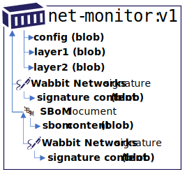
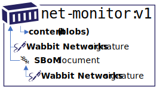

# Detailed Demo Steps

The following demonstrates the underlying details of **prototype-2**.

> At this point, this is a target experience, that is still being developed.

## Demo Setup

Perform the following steps prior to the demo:

- Install [Docker Desktop](https://www.docker.com/products/docker-desktop) for local docker operations
- [Install and Build the nv2 Prerequisites](./README.md#prerequisites)
- Create an empty working directory:
  ```bash
  mkdir nv2-demo
  cd nv2-demo/
  ```
- Generate the Wabbit Networks Public and Private Keys:
  ```bash
  openssl req \
    -x509 \
    -sha256 \
    -nodes \
    -newkey rsa:2048 \
    -days 365 \
    -subj "/CN=registry.wabbit-networks.io/O=wabbit-networks inc/C=US/ST=Washington/L=Seattle" \
    -addext "subjectAltName=DNS:registry.wabbit-networks.io" \
    -keyout ./wabbit-networks.key \
    -out ./wabbit-networks.crt
  ```
- Start a local registry instance:
  ```bash
  # NOTE: the nv2-prototype-2 image does not yet exist
  docker run -d -p 80:5000 --restart always --name registry notaryv2/registry:nv2-prototype-2
  ```
- Add a `etc/hosts` entry to simulate pushing to registry.wabbit-networks.io
  - If running on windows, _even if using wsl_, add the following entry to: `C:\Windows\System32\drivers\etc\hosts`
    ```hosts
    127.0.0.1 registry.wabbit-networks.io
    ```

## Demo Reset

If iterating through the demo, these are the steps required to reset to a clean state:

- Remove docker alias:
  ```bash
  unalias docker
  ```
- Reset the local registry:
  ```bash
  docker rm -f $(docker ps -a -q)
  docker run -d -p 80:5000 --restart always --name registry notaryv2/registry:nv2-prototype-1
  ```
- Remove the `net-monitor:v1` image:
  ```bash
  docker rmi -f registry.wabbit-networks.io/net-monitor:v1
  ```
- Remove `wabbit-networks.crt` from `"verificationCerts"`:
  ```bash
  code ~/.docker/nv2.json
  ```

## The End to End Experience


- Wabbit Networks is a small software company that produces network monitoring software.
- ACME Rockets wishes to acquire network monitoring software.
- ACME Rockets doesn't know about Wabbit Networks, but finds their [net-monitor software in Docker Hub](https://hub.docker.com/r/wabbitnetworks/net-monitor)
- Since they've never heard of Wabbit Networks, they're a little reluctant to run network software without some validations.
- ACME Rockets has a policy to only import Docker Hub certified software, or approved vendors.
- Wabbit Networks works with Docker Hub to get certified, to help with their customer confidence.
- ACME Rockets will only deploy software that's been scanned and approved by the ACME Rockets security team. They know it's been approved because all approved software has been signed by the ACME Rockets security team.

## Wabbit Networks Build, Sign, Promote Process

Let's walk through the sequence of operations Wabbit Networks takes to build, sign and promote their software.

Within the automation of Wabbit Networks, the following steps are completed:

### Build the `net-monitor` image

  ```bash
  docker build \
      -t registry.wabbit-networks.io/net-monitor:v1 \
      https://github.com/wabbit-networks/net-monitor.git#main
  ```

### Generate the manifest

In normal docker operations, the image manifest is a hidden element the user doesn't have to deal with. For the sake full transparency, we'll highlight the full workflow by generating the manifest to sign the digest:

```bash
docker generate manifest registry.wabbit-networks.io/net-monitor:v1 > net-monitor_v1-manifest.json

# view the manifest
cat ./net-monitor_v1-manifest.json
```

### Acquire the private key

> TODO: Add any key management prototype steps here:

- As a best practice, we'll always build on an ephemeral client, with no previous state.
- The ephemeral client will retrieve the private signing key from the companies secured key vault provider.

These specific steps are product/cloud specific, so we'll assume these steps have been completed and we have the required keys.

### Sign the image

Using the private key, we'll sign the `net-monitor:v1` image. Note, we're signing the image with a registry name that we haven't yet pushed to. This enables offline signing scenarios. This is important as the image will eventually be published on `registry.wabbit-networks.io/`, however their internal staging and promotion process may publish to internal registries before promotion to the public registry.

- Generates an [nv2 signature][nv2-signature], persisted locally as `net-monitor_v1.signature.jwt`

  ```shell
  nv2 sign -m x509 \
    -o net-monitor_v1.signature-jwt \
    -k ~/.ssh/wabbit-networks.key \
    -r registry.wabbit-networks.io/net-monitor:v1 \
    file:net-monitor_v1-manifest.json

  # view the signature
  cat ./net-monitor_v1-signature.jwt
  ```

### Generate an SBoM

This demo focuses on the signing of additional content, including an SBoM. It doesn't focus on a specific SBoM format. As a result, we'll generate the most basic, and _admittedly_ useless SBoM document:

```bash
echo '{"version": "0.0.0.0", "image": "registry.wabbit-networks.io/net-monitor:v1", "contents": "good"}' > sbom_v1.json
```

### Sign the SBoM

This is where some of the Notary v2 signature and persistance formats come through. Notary v2 signs a _**Registry Manifest**_. Registry manifests are things that describe the content that's persisted in the registry. There are two manifest formats today: [image-manifest][oci-image-manifest] and [image-index][oci-image-index]. These manifests describe self-contained content, for container images. Since Notary v2 signatures are enhancements to exiting content, we need a way to describe self-contained content that references existing content. An SBoM is yet another type of reference content. The [oci.artifact.manifest][oci-artifact-manifest] provides the ability to describe self-contained content, and link to existing content.

To enable a Notary v2 signature of an [oci.artifact.manifest][oci-artifact-manifest], we first need to generate that manifest. In the container scenarios, we used the [docker-generate][docker-generate] plug-in to generate a manifest for container images.

- For non-container images, we'll use the [ORAS cli][oras] to generate an [oci.artifact.manifest][oci-artifact-manifest].
  ```bash
  oras generate-manifest \
    --manifest-type application/vnd.oci.artifact.manifest.v1 \
    --artifact-type application/vnd.example.sbom.v0 \
    --manifests oci://registry.wabbit-networks.io/net-monitor@sha256:1a0a0a89a \
    --output sbom_v1-manifest.json \
    ./sbom_v1.json

  # view the manifest
  cat sbom_v1-manifest.json
  ```

- Sign the manifest that represents the SBoM.

  ```bash
  nv2 sign -m x509 \
    -k ~/.ssh/wabbit-networks.key \
    -r registry.wabbit-networks.io/net-monitor:v1 \
    -o net-monitor_v1-sbom.signature.jwt \
    file:sbom_v1-manifest.json

  # view the signature
  cat ./net-monitor_v1-sbom.signature.jwt
  ```

### Summary of artifacts

At this point we have the following artifacts and content:



- the `net-monitor:v1` image
  - the blob content of the `net-monitor:v1` image
- a wabbit-networks signature of the `net-monitor:v1` image
  - the blob content of the signature
- an SBoM for the `net-monitor:v1` image
  - the blob content of the sbom
- a wabbit-networks signature of the `net-monitor:v1` sbom
  - the blob content of the signature for the sbom



Viewed with less detail, the above image represents 4 artifacts connected through linked manifests:

1. the `net-monitor:v1` image
1. a wabbit-networks signature of the `net-monitor:v1` image
1. an SBoM for the `net-monitor:v1` image
1. a wabbit-networks signature of the `net-monitor:v1` sbom

### Push artifacts to the registry

- Push the container image

  ```bash
  docker push registry.wabbit-networks.io/net-monitor:v1
  ```

- Push the `net-monitor:v1` signature to the registry using ORAS

  ```bash
  # implies a new means to push an artifact to a repo, without a tag
  # need a good design for how to declare content is pushed, where the digest is computed by ORAS, or the underlying tool
  # linked-manifest uses digests to assure links are established to the specific artifact, avoiding conflicts to updating tags
  # artifact-type replaces 
  oras push registry.wabbit-networks.io/net-monitor \
      --push-as-digest \
      --artifact-type application/vnd.cncf.notary.v2 \
      --manifest-type application/vnd.oci.artifact.manifest.v1 \
      --manifests registry.wabbit-networks.io/net-monitor@sha256:12as1201... \
      --plain-http \
      ./net-monitor_v1.signature.jwt
  ```

- Push the `net-monitor:v1` **sbom** to the registry using ORAS

  ```bash
  oras push registry.wabbit-networks.io/net-monitor \
      --push-as-digest \
      --artifact-type application/vnd.example.sbom.v0 \
      --manifest-type application/vnd.oci.artifact.manifest.v1 \
      --manifest registry.wabbit-networks.io/net-monitor@sha256:12as1201... \
      --plain-http \
      ./sbom_v1-manifest.json
  # Note: need to capture the digest of the pushed SBoM, for the linkage of the signature
  ```

- Push the `net-monitor:v1` **sbom signature** to the registry using ORAS

  ```bash
  oras push registry.wabbit-networks.io/net-monitor \
      --push-as-digest \
      --artifact-type application/vnd.cncf.notary.v2 \
      --manifest-type application/vnd.oci.artifact.manifest.v1 \
      --manifest registry.wabbit-networks.io/net-monitor@sha256:12as1201... \
      --plain-http \
      ./net-monitor_v1-sbom.signature.jwt
  ```

## Pulling Validated Content

To represent a deployed, ephemeral node, we'll pull the `net-monitor:v1` image, validating the signature of the image and the sbom.

### Clear the build content

To simulate another client, we'll clear out the `net-monitor:v1` image and signature, simulating a new environment.

> Note: The public and private keys are maintained, deferring to key management prototypes for how keys should be acquired.

```bash
docker rmi -f registry.wabbit-networks.io/net-monitor:v1
rm *.jwt
rm *.json
```

### Attempt, and fail to pull the image

Simulate a notary enabled client, which doesn't yet have the public keys configured.

- Get the digest for the `net-monitor:v1` image:
  ```bash
  NET_MONITOR_DIGEST=$(curl -v -H "Accept: application/vnd.docker.distribution.manifest.v2+json" \
      registry.wabbit-networks.io/v2/net-monitor/manifests/v1 2>&1 | \
      grep -i 'Docker-Content-Digest:' | \
      awk '{print $3}')
  ```
- Query for Notary v2 linked artifacts
  ```bash
  curl -v -H "Accept: artifactType=application/vnd.cncf.notary.v2" \
    registry.wabbit-networks.io/v2/_ext/oci-artifacts/net-monitor/manifests/${NET_MONITOR_DIGEST}/links
  NET_MONITOR_SIG_DIGEST=^
  ```
- Retrieve the `net-monitor:v1` notary v2 signature
  ```bash
  oras pull registry.wabbit-networks.io/net-monitor@sha256:${NET_MONITOR_SIG_DIGEST} \
      --plain-http
  ```
- Validate the signature
  ```bash
  nv2 verify \
    -c ./wabbit-networks.crt \
    -f net-monitor_v1.signature.jwt \
    oci://registry.wabbit-networks.io/net-monitor:v1
  ```
  The above validation will fail, as we haven't yet configured notary to find the `wabbit-networks.crt` public key.
- Configure Notary access to the wabbit-networks key
  ```bash
  code ~/.docker/nv2.json
  ```
- Add the path to the cert:
  ```json
  "verificationCerts": [
		"/home/stevelas/nv2-demo/wabbit-networks.crt"
	]
  ```
- Validate the signature
  ```bash
  nv2 verify \
    -c ./wabbit-networks.crt \
    -f net-monitor_v1.signature.jwt \
    oci://registry.wabbit-networks.io/net-monitor:v1
  ```

- Pull the image, as the signature validation succeeded
  ```bash
  docker pull $image
  ```

## Appendix

### Convert the tag to a digest

```bash
curl -H "Accept: application/vnd.docker.distribution.manifest.v2+json" -vvv -k registry.wabbit-networks.io/v2/net-monitor/manifests/v1
curl -H "Accept: application/vnd.oci.image.manifest.v2+json" -vvv -k registry.wabbit-networks.io/v2/net-monitor/manifests/v1
curl -vvv -k registry.wabbit-networks.io/v2/net-monitor/manifests/v1

curl -v -H "Accept: application/vnd.docker.distribution.manifest.v2+json" \
    https://mcr.microsoft.com/v2/aks/hcp/etcd-azure/manifests/v3.1.19 2>&1 | \
    grep -i 'Docker-Content-Digest:' | \
    awk '{print $3}'
curl -v -H "Accept: application/vnd.oci.image.manifest.v2+json" \
    https://mcr.microsoft.com/v2/aks/hcp/etcd-azure/manifests/v3.1.19 2>&1 | \
    grep -i 'Docker-Content-Digest:' | \
    awk '{print $3}'

curl -v -H "Accept: application/vnd.oci.image.manifest.v2+json" \
    https://mcr.microsoft.com/v2/aks/hcp/etcd-azure/manifests/v3.1.19 2>&1 | \
    grep -i 'Docker-Content-Digest:' | \
    awk '{print $3}'
   


curl -v -H "Accept: application/vnd.oci.image.manifest.v2+json" \
    registry.wabbit-networks.io/v2/net-monitor/manifests/v1 2>&1 | \
    grep -i 'Docker-Content-Digest:' | \
    awk '{print $3}'
```

### Query for linked artifacts

```bash
GET /v2/_ext/{repository}/manifests/{digest}/links?artifactType=application/vnd.oci.notary.v2.config+json&n=10
GET registry.wabbit-networks.io/v2/_ext/net-monitor/manifests/{digest}/links?artifactType=application/vnd.oci.notary.v2.config+json

```

#### Validate the image

To validate an image, we need the signature, which can be pulled prior to the image. We want to avoid pulling images we haven't validated, as this could be a trojan horse type exploit.

```bash
oras pull registry.wabbit-networks.io/net-monitor:v1-signature -a --plain-http
```
> TODO: Fix CN validation
```bash
nv2 verify \
  -c ~/.ssh/wabbit-networks.crt \
  -f net-monitor_v1.signature.jwt \
  file:net-monitor_v1-manifest.json

nv2 verify \
  -c ~/.ssh/wabbit-networks.crt \
  -f net-monitor_v1.signature.jwt \
  oci://registry.wabbit-networks.io/net-monitor:v1

2021/03/02 14:27:38 verification failure: x509: certificate relies on legacy Common Name field, use SANs or temporarily enable Common Name matching with GODEBUG=x509ignoreCN=0
```

[docker-generate]:        https://github.com/shizhMSFT/docker-generate
[nv2-signature]:          ../signature/README.md
[oci-image-manifest]:     https://github.com/opencontainers/image-spec/blob/master/manifest.md
[oci-image-index]:        https://github.com/opencontainers/image-spec/blob/master/image-index.md
[oci-artifact-manifest]:  https://github.com/opencontainers/artifacts/blob/3e34f029537052639eed59b469cb6c43706ac3d0/artifact-manifest.md
[oras]:                   https://github.com/deislabs/oras