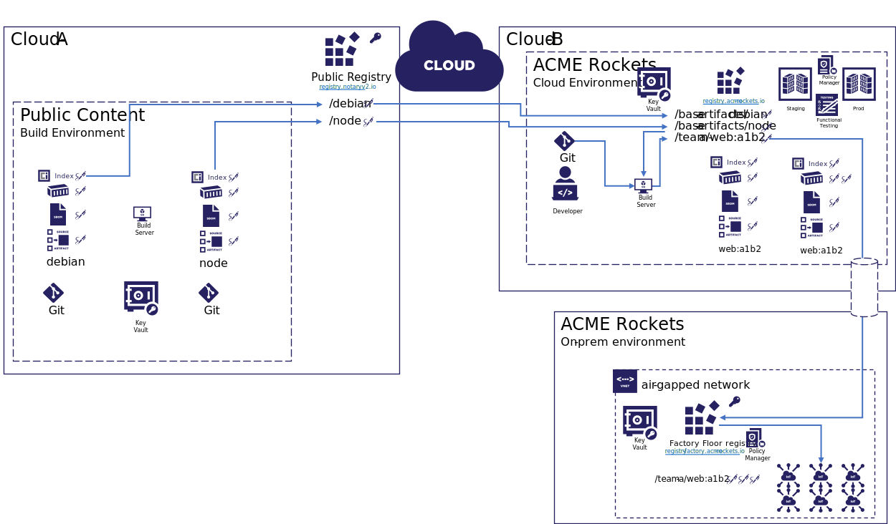

# Demo Steps

The following demonstrates the capabilities of [Notary v2 - Prototype-2][nv2-prototype-2].

## Demo Setup

Perform the following steps prior to the demo:

- Install [Docker Desktop](https://www.docker.com/products/docker-desktop) for local docker operations
- [Install and Build nv2](../../building.md)
- [Install and Build the ORAS Prototype-2 branch](https://github.com/deislabs/oras/blob/prototype-2/docs/artifact-manifest.md)
- Generate the `~/.docker/nv2.json` config file
  ```bash
  docker nv2 notary --enabled
  ```
- Setup names and variables with `localhost:5000`
  >**NOTE:** See [Simulating a Registry DNS Name](#simulating-a-registry-dns-name) for using `registry.wabbit-networks.io`
  ```bash
  export PORT=5000
  export REGISTRY=localhost:${PORT}
  export REPO=${REGISTRY}/net-monitor
  export IMAGE=${REPO}:v1
  ```

- Generate the Wabbit Networks Public and Private Keys:
  ```bash
  openssl req \
    -x509 \
    -sha256 \
    -nodes \
    -newkey rsa:2048 \
    -days 365 \
    -subj "/CN=${REGISTRY}/O=wabbit-networks inc/C=US/ST=Washington/L=Seattle" \
    -addext "subjectAltName=DNS:${REGISTRY}" \
    -keyout ./wabbit-networks.key \
    -out ./wabbit-networks.crt
  ```
### Start a Local Registry Instance
  ```bash
  docker run -d -p ${PORT}:5000 notaryv2/registry:nv2-prototype-2
  ```

## Demo The End to End Experience

- Wabbit Networks is a small software company that produces network monitoring software.
- ACME Rockets wishes to acquire network monitoring software.
- ACME Rockets doesn't know about Wabbit Networks, but finds their [net-monitor software in Docker Hub](https://hub.docker.com/r/wabbitnetworks/net-monitor)
- Since they've never heard of Wabbit Networks, they're a little reluctant to run network software without some validations.
- ACME Rockets has a policy to only import Docker Hub certified software, or approved vendors.
- Wabbit Networks works with Docker Hub to get certified, to help with their customer confidence.
- ACME Rockets will only deploy software that's been scanned and approved by the ACME Rockets security team. They know it's been approved because all approved software has been signed by the ACME Rockets security team.



### Alias `nv2` Commands

- To avoid having to type `docker nv2` each time, create an alias:
  ```bash
  alias docker="docker nv2"
  ```

## Wabbit Networks Build, Sign, Promote Process

Let's walk through the sequence of operations Wabbit Networks takes to build, sign and promote their software.

Within the automation of Wabbit Networks, the following steps are completed:

1. Building the `net-monitor` image
1. Sign the `net-monitor` image
1. Push the image and signature
1. Create and push a signed SBoM

### Build the `net-monitor` image

- Build the image, directly from GitHub to simplify the sequence.
  ```bash
  docker build \
    -t $IMAGE \
    https://github.com/wabbit-networks/net-monitor.git#main
  ```
  _To represent an ephemeral client in an air-gapped environment, git clone, then build with `.` as the context_

### Acquire the private key

- As a best practice, we'll always build on an ephemeral client, with no previous state.
- The ephemeral client will retrieve the private signing key from the companies secured key vault provider.

These specific steps are product/cloud specific, so we'll assume these steps have been completed.

### Sign and Push the Image and Signature

Using the private key, we'll sign the `net-monitor:v1` image. Note, we're signing the image with a registry name that we haven't yet pushed to. This enables offline signing scenarios. This is important as the image will eventually be published on `registry.wabbit-networks.io/`, however their internal staging and promotion process may publish to internal registries before promotion to the public registry.

- Generate an [nv2 signature][nv2-signature], persisted locally as `net-monitor_v1.signature.jwt`

- Enable notary, for the nv2 extension to account for signing and verification steps
  ```shell
  docker notary --enabled
  ```
- Generate an [nv2 signature][nv2-signature], persisted within the `/.docker/nv2/sha256/` directory:
  ```shell
  docker notary sign \
    --key ./wabbit-networks.key \
    --cert ./wabbit-networks.crt \
    $IMAGE
  ```
- Push the image, with the signature
  ```bash
  docker push $IMAGE
  ```
- View the output, which includes pushing the signature as a reference:
  ```bash
  The push refers to repository [registry.wabbit-networks.io/net-monitor]
  8ea3b23f387b: Preparing
  8ea3b23f387b: Pushed
  v1: digest: sha256:31c6d76b9a0af8d2c0a7fc16b43b7d8d9b324aa5ac3ef8c84dc48ab5ba5c0f49 size: 527
  Pushing signature
  signature manifest: digest: sha256:8eb7394c8f287ebd0e84a4659f37a2688c6e07e39906933ccb83d9011fb29034 size: 2534
  refers to manifests: digest: sha256:31c6d76b9a0af8d2c0a7fc16b43b7d8d9b324aa5ac3ef8c84dc48ab5ba5c0f49 size: 527
  ```
- Discover the references using the [oras prototype-2 branch](https://github.com/deislabs/oras/tree/prototype-2).
  ```bash
  oras discover \
    --plain-http \
    $IMAGE
  ```

### Validate the image

To validate an image, `docker pull` with `docker notary --enabled` will attempt to validate the image, based on the local keys.

- Attempt to pull the `net-monitor:v1` image:
  ```bash
  docker pull $IMAGE
  ```

- The above command will fail, as we haven't configured the `nv2` client access to the public keys.
  ```bash
  Looking up for signatures
  Found 1 signatures
  2021/03/02 18:34:47 none of the signatures are valid: verification failure: x509: certificate signed by unknown authority
  ```

- Open the `nv2.json` configuration file:
  ```bash
  code ~/.docker/nv2.json
  ```

- Add the wabbit networks public key:
  ```json
  {
    "enabled": true,
    "verificationCerts": [
      "/home/<user>/nv2-demo/wabbit-networks.crt"
    ]
  }
  ```

- Pull the `net-monitor:v1` image, using the public key for verification:
  ```bash
  docker pull $IMAGE
  ```
- The validated pull can be seen:
  ```bash
  v1 digest: sha256:48575dfb9ef2ebb9d67c6ed3cfbd784d635fcfae8ec820235ffa24968b3474dc size: 527
  Looking up for signatures
  Found 1 signatures
  Found valid signature: sha256:282f5475ac4788f5c0ce3c0c44995726192385c2cae85d0f04da12595707a73f
  The image is originated from:
  - registry.wabbit-networks.io/net-monitor:v1
  registry.wabbit-networks.io/net-monitor@sha256:48575dfb9ef2ebb9d67c6ed3cfbd784d635fcfae8ec820235ffa24968b3474dc: Pulling from net-monitor
  Digest: sha256:48575dfb9ef2ebb9d67c6ed3cfbd784d635fcfae8ec820235ffa24968b3474dc
  Status: Downloaded newer image for registry.wabbit-networks.io/net-monitor@sha256:48575dfb9ef2ebb9d67c6ed3cfbd784d635fcfae8ec820235ffa24968b3474dc
  registry.wabbit-networks.io/net-monitor@sha256:48575dfb9ef2ebb9d67c6ed3cfbd784d635fcfae8ec820235ffa24968b3474dc  
  ```

### Create a Software Bill of Materials

- Create an overly simplistic SBoM
  ```bash
  echo '{"version": "0.0.0.0", "artifact": "net-monitor:v1", "contents": "good"}' > sbom.json
  ```
- Push the SBoM with ORAS, saving the manifest for signing
  ```bash
  oras push $REPO \
    --artifact-type application/x.example.sbom.v0 \
    --artifact-reference $IMAGE \
    --export-manifest sbom-manifest.json \
    --plain-http \
    ./sbom.json:application/tar
  ```
- View the references with `oras discover`:
  ```bash
  oras discover \
    --plain-http \
    $IMAGE
  ```

### Sign the SBoM

In the above case, the SBoM has already been pushed to the registry. To sign it before pushing, we could have used `oras push` with the `--dry-run` and `--export-manifest` options.

- For non-container images, we'll use the `nv2` cli to sign and  the `oras` cli to push to a registry. We'll use the `oras discover` cli to find the sbom digest the signature will reference.
  ```bash
  nv2 sign \
    -m x509 \
    -k wabbit-networks.key \
    -c wabbit-networks.crt \
    --plain-http \
    --push \
    --push-reference oci://${REPO}@$(oras discover \
      --artifact-type application/x.example.sbom.v0 \
      --output-json \
      --plain-http \
      $IMAGE | jq -r .references[0].digest) \
    file:sbom-manifest.json
  ```
- Dynamically get the SBoM digest
  ```bash
  DIGEST=$(oras discover \
      --artifact-type application/x.example.sbom.v0 \
      --output-json \
      --plain-http \
      $IMAGE | jq -r .references[0].digest)
- Discover referenced artifacts of the SBoM
  ```bash
  oras discover \
    --plain-http \
    ${REPO}@${DIGEST}
  ```
- Generates:
  ```bash
  Discovered 1 artifacts referencing localhost:5000/net-monitor@sha256:adfe3a3c50838fc2a19d5d7e73119dcadad7ad8e4e98f1e0fd100dd9d2278b71
  Digest: sha256:adfe3a3c50838fc2a19d5d7e73119dcadad7ad8e4e98f1e0fd100dd9d2278b71

  Artifact Type                    Digest
  application/vnd.cncf.notary.v2   sha256:b7fc5fdb81f2ada359d0a709004360d1f08c9d2ac8a80630b152d1c6fb35460e
  ```

The above workflow demonstrates the **Notary v2, prototype-2** target experience.

## Optional Steps

Some optional steps:

## Demo Reset

If iterating through the demo, these are the steps required to reset to a clean state:

- Remove docker alias:
  ```bash
  unalias docker
  ```
- Reset the local registry:
  ```bash
  docker rm -f $(docker ps -a -q)
  docker run -d -p ${PORT}:5000 notaryv2/registry:nv2-prototype-2
  ```
- Remove the `net-monitor:v1` image:
  ```bash
  docker rmi -f ${REGISTRY}/net-monitor:v1
  ```
- Remove `wabbit-networks.crt` from `"verificationCerts"` in the `nv2.json` configuration file:
  ```bash
  code ~/.docker/nv2.json
  ```
- Remove previous signatures:
  ```bash
  rm -r ~/.docker/nv2/sha256/
  ```

### Simulating a Registry DNS Name

Configure the additional steps to simulate a fully qualified dns name for wabbit-networks.

- Setup names and variables with `registry.wabbit-networks.io`
  ```bash
  export PORT=80
  export REGISTRY=registry.wabbit-networks.io
  export REPO=${REGISTRY}/net-monitor
  export IMAGE=${REPO}:v1
  ```
- Edit the `~/.docker/nv2.json` file to support local, insecure registries
  ```json
  {
    "enabled": true,
    "verificationCerts": [
    ],
    "insecureRegistries": [
      "registry.wabbit-networks.io"
    ]
  }
  ```
- Add a `etc/hosts` entry to simulate pushing to registry.wabbit-networks.io
  - If running on windows, _even if using wsl_, add the following entry to: `C:\Windows\System32\drivers\etc\hosts`
    ```hosts
    127.0.0.1 registry.wabbit-networks.io
    ```
- Continue with [Start a Local Registry Instance](#start-a-local-registry-instance)

[docker-generate]:        https://github.com/notaryproject/nv2/tree/prototype-2
[nv2-signature]:          ../signature/README.md
[oci-image-manifest]:     https://github.com/opencontainers/image-spec/blob/master/manifest.md
[oci-image-index]:        https://github.com/opencontainers/image-spec/blob/master/image-index.md
[oci-artifact-manifest]:  https://github.com/SteveLasker/artifacts/blob/oci-artifact-manifest/artifact-manifest.md
[oras]:                   https://github.com/deislabs/oras/tree/prototype-2
[nv2-prototype-2]:        https://github.com/notaryproject/notaryproject/issues/53
