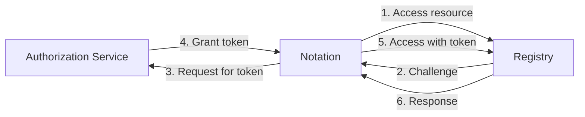
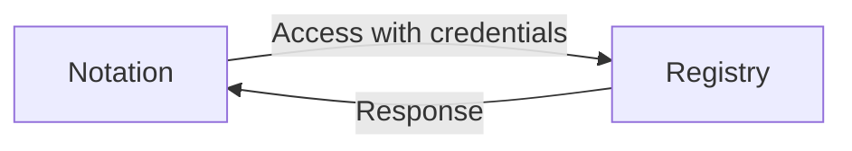

# Registry Authentication

Registry access is required for pulling the manifests of the images to be verified along with their signatures as well as other advanced operations. This documentation specifies how authentication to the remote registry works and how registry credentials are stored.

## Communication Channel

Although it is secure to transmit artifacts with their signatures via HTTP connections, it is RECOMMENDED to transmit via HTTPS connections for confidentiality and the authenticity of the remote server.

Alternatively, clients can be authenticated via mutual TLS authentication (mTLS). In other words, clients connect to servers via HTTP over mTLS by presenting client certificates. In this case, authorization can be applied later without further authentication schemes.

## Authentication Schemes

Notation supports [basic HTTP authentication][RFC7617] scheme and token schemes including [OAuth 2.0][RFC6749] and [Docker Registry V2 Token][token]. Clients MUST connect to the remote servers via HTTPS if any authentication scheme is applied.

### General Flow

In general, the `notation` accesses registry resources as the workflow below, which follows the workflow for [Docker Registry v2 authentication via central service](https://docs.docker.com/registry/spec/auth/token/).

1. `notation` attempts to access the remote registry directly. If there is no authentication scheme associated with the registry, skip to *step 6*.
2. The remote registry returns `401 Unauthorized` with a [WWW-Authenticate](https://datatracker.ietf.org/doc/html/rfc7235#section-4.1) challenge, indicating the required authentication scheme.
3. `notation` requests the authorization service for a bearer token for accessing the target resource with local credentials. If the remote registry requires *basic* scheme, skip to *step 5*.
4. The authorization grants and returns a bearer token for access back to the `notation` client.
5. `notation` attempts to access the remote registry again with the obtained bearer token (or local credential for *basic* scheme) in the [Authorization](https://datatracker.ietf.org/doc/html/rfc7235#section-4.2) header.
6. The remote registry performs the requested operation and returns the response.

Optimization might be performed to reduced the number of requests in order to reduce the overall latency for subsequent requests.

### Basic Scheme

`notation` follows [RFC 7617][RFC7617] for the *Basic* HTTP authentication scheme.

If a remote registry is known to support `Basic` authentication scheme, the attempt-challenge phase (*steps 1-4*) can be skipped, and thus `notation` can access the remote registry without overhead in terms of the number of requests.

### Token Scheme

#### Docker

#### OAuth 2

## Credential Store

### Credential File

### Credential Helper

[RFC6749]: https://www.rfc-editor.org/rfc/rfc6749 "OAuth 2.0"
[RFC7617]: https://www.rfc-editor.org/rfc/rfc7617 "Basic Auth"
[token]: https://docs.docker.com/registry/spec/auth/jwt/ "Docker Token Authentication"