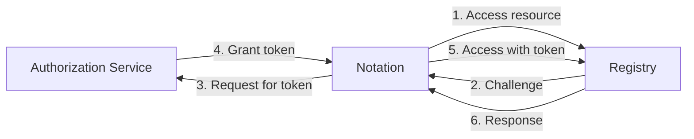
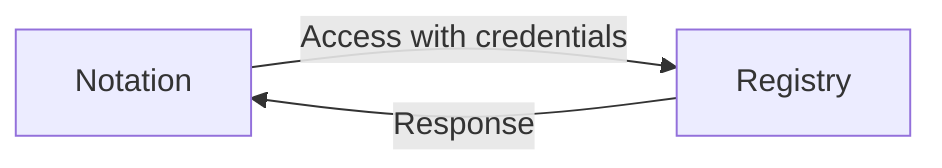
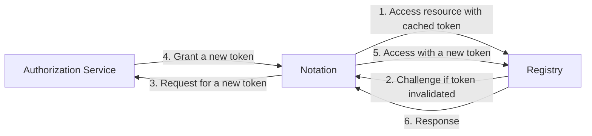

# Registry Authentication

Registry access is required for pulling the manifests of the images to be verified along with their signatures as well as other advanced operations. This documentation specifies how authentication to the remote registry works and how registry credentials are stored.

## Communication Channel

Although it is secure to transmit artifacts with their signatures via HTTP connections as a tampered artifact can be detected through signature verification, it is RECOMMENDED to transmit via HTTPS connections for confidentiality and the authenticity of the remote server.

Alternatively, clients can be authenticated via mutual TLS authentication (mTLS). In other words, clients connect to servers via HTTP over mTLS by presenting client certificates. In this case, authorization can be applied later without further authentication schemes.

## Authentication Schemes

Notation supports [basic HTTP authentication][RFC7617] scheme and token schemes including [OAuth 2.0][RFC6749] and [Docker Registry V2 Token][token]. Clients SHOULD connect to the remote servers via HTTPS if any authentication scheme is applied.

### General Flow



In general, notation clients accesses registry resources as the workflow below, which follows the workflow for [Docker Registry v2 authentication via central service](https://docs.docker.com/registry/spec/auth/token/).

1. Notation attempts to access the remote registry directly. If there is no authentication scheme associated with the registry, skip to *step 6*.
2. The remote registry returns `401 Unauthorized` with a [WWW-Authenticate](https://datatracker.ietf.org/doc/html/rfc7235#section-4.1) challenge, indicating the required authentication scheme.
3. Notation requests the authorization service for a bearer token for accessing the target resource with local credentials. If the remote registry requires *basic* scheme, skip to *step 5*.
4. The authorization grants and returns a bearer token for access back to the notation client.
5. Notation attempts to access the remote registry again with the obtained bearer token (or local credential for *basic* scheme) in the [Authorization](https://datatracker.ietf.org/doc/html/rfc7235#section-4.2) header.
6. The remote registry performs the requested operation and returns the response.

Optimization might be performed to reduced the number of requests in order to reduce the overall latency for subsequent requests.

### Basic Scheme

Notation follows [RFC 7617][RFC7617] for the *Basic* HTTP authentication scheme.

If a remote registry is known to support `Basic` authentication scheme, the attempt-challenge phase (*steps 1-4*) can be skipped, and thus Notation can access the remote registry without overhead in terms of the number of requests.



### Token Scheme

Notation supports two types of token schemes, [Docker][token] and [OAuth 2.0][RFC6749] where OAuth 2.0 is preferred by default.

Since token authentication schemes have two more requests per registry requests, notation client implementations SHOULD cache the token to reduce the number of requests. 



The workflow is updated as follows with caching.

1. Notation attempts to access the remote registry using a cached token. If the token is valid, skip to *step 6*.
2. The remote registry returns `401 Unauthorized` with a challenge, requiring a valid token.
3. Notation requests the authorization service for a new bearer token for accessing the target resource with local credentials.
4. The authorization grants and returns a new bearer token for access back to the notation client. The client-side cache is refreshed by the newly returned token.
5. Notation attempts to access the remote registry again.
6. The remote registry performs the requested operation and returns the response.

#### Docker

In the [Docker Token Authentication][token] specification, the *step 3* is implemented using a `GET` request where users are authenticated by the authorization service via `Basic` authentication scheme. Therefore, user credentials are only accepted in the form of username and password pair.

#### OAuth 2

Notation follows the [Docker Registry v2 authentication][oauth2] specification for the [OAuth 2.0][RFC6749] framework where the *step 3* is implemented using a `POST` request. Precisely, notation supports `password` and `refresh_token` grant types.

**Note** Refresh tokens are often known as identity tokens in the context of registry authentication.

## Credential Store

As local credentials may be required to access the remote registries, they need to be stored and accessed securely. To achieve maximum security, credential helpers are preferred so that credentials are stored in the system key chain with better protection. If credential helpers are not available, credentials SHOULD be provided to notation via command line parameters `--username` / `--password` or environment variables `NOTATION_USERNAME` / `NOTATION_PASSWORD`.

### Credential Helper

To achieve maximum compatibility with existing systems, [docker credential helpers](https://github.com/docker/docker-credential-helpers) and its [protocol](https://docs.docker.com/engine/reference/commandline/login/#credential-helper-protocol) are adopted as the credential helpers for `notation`.

The credential store can be specified globally or per registry by setting the notation config.

```json
{
    "credHelpers": {
        "registry.wabbit-networks.io": "wabbithelper",
        "another.wabbit-networks.io": "foobar"
    },
    "credsStore": "whatever"
}
```

[RFC6749]: https://www.rfc-editor.org/rfc/rfc6749 "OAuth 2.0"
[RFC7617]: https://www.rfc-editor.org/rfc/rfc7617 "Basic Auth"
[token]: https://docs.docker.com/registry/spec/auth/jwt/ "Docker Token Authentication"
[oauth2]: https://docs.docker.com/registry/spec/auth/oauth/ "Docker Registry v2 authentication using OAuth2"