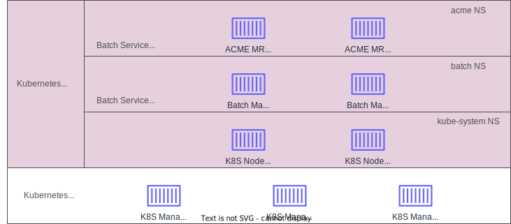

# Trust Store and Trust Policy Scenarios

## Overview
This document is intented to describe how the trust store and the trust policies will be used in real-live applications. 
The document will concentrate on container-based applications but the concepts can be extended to any other type of application. 

## Related Links
The following documents are related to the scenarios described in this document. Reading those will provide additional context:
- [Notary v2 Signing Scenarios](https://github.com/notaryproject/notaryproject/blob/main/scenarios.md#scenario-0-build-publish-consume-enforce-policy-deploy)
- [Trust Store and Trust Policy Specification](https://github.com/notaryproject/notaryproject/blob/main/specs/trust-store-trust-policy.md)
- [Key Management Requirements](https://github.com/notaryproject/notaryproject/blob/main/keymanagementrequirements.md)

## Background Information
For the purpose of the scenarios clarity, we will start with a description of a modern containerized application and how it is deployed and used by customers. This section will also introduce some terminology that will be used later on in the document.

Many modern applications are deployed on a *Kubernetes cluster*. In many cases the cluster is used in a multi-tenant scenarios and it is managed by either the cloud provider or a central team in the organization. Also, for the purposes of the Kubernetes' operation, containers used to manage the cluster are deployed in the `kube-system` namespace. The *Kubernetes cluster* is considered the base or *platform layer* for our scenarios.

Cloud vendors or internal organizations deploy *services* on top of Kubernetes. Those services can provide direct benefits to end users or can be used by other service teams to extend the capabilities of the platform. One example of such services are Batch service that can be used by customers to run a large scale jobs on top of Kubernetes. Each one of those services can be deployed in a separate namespace to provide seggregation. We will call this layer the *service layer* for our scenarios.

Customers who leverage the services, can deploy their own workloads in the form of containers. In the above example with Batch, customers may build a map-reduce application that runs the mapping and reducing tasks as containers and deploy it on top of the Batch service. This is the *application layer* for our scenarios. 

Here is how this stack looks like:

| layer | description | example |
| ----- | ----- | ----- |
| application | Customer application deployed in the form of containers using the services provided in the previous layer | Map-Reduce Application|
| service | Containerized services deployed on the platform | Batch Service |
| platform | Infrastructure management platform allowing elastic expansion of the workloads | Kubernetes | 

To further clarify the distinction between the service workloads and the application workaloads, we can use the following diagram.



As you can see in the diagram, containers from three different actors are running on the Kubernetes cluster.

Note that the above is a simplified example of the layering of services and applications on top of the platform. We should not limit ourselves to the above three layers only but assume that there may be more layers in the stack.

## Actors and Areas of Reponsibilities
We have already hinted to the actors above, but let's clearly identify those and provide a bit more details about their operational practices. In the spirit of the broader scenarios we will use the Wabbit Networks and ACME Rockets as fictitious companies and we will introduce two divisions for the Wabbit Networks company:
- Wabbit Networks Kubernetes (WNK) is the team managing the *platform layer* (i.e. the Kubernetes cluster) within the Wabbit Networks company
- Wabbit Networks Batch (WNB) team is the team managing the *service layer* (i.e. the Batch service) within the Wabit Networks company

As usual ACME Rockets (ACME) is the customer that deploys the Batch applications and they own the *application layer*.

Quite often, different teams in the enterprise have separate container registries for storing the images they need for their services. To deploy the Kubernetes cluster, the WNK team manages a set of images in the `k8s.wabbitnetworkscr.io` registry. To deploy the Batch service, the WNB team manages a set of images in the `batch.wabbitnetworkscr.io`. And, of course, the customer ACME manages their application images in the `mr.acmecr.io` registry.

Furthermore, for security reasons, the teams within Wabbit Networks sign the images with their own keys devided from the Wabbit Networks root. ACME's team signs their images with a key that is derived from the ACME root key.

## Registry to Signing Key Mapping
Here is the mapping between registries and keys based on the above:

| root | signing key | registry |
| ----- | ----- | ----- |
| Wabbit Networks | Wabbit Networks Kubernetes private key | `k8s.wabbitnetworkscr.io` |
| Wabbit Networks | Wabbit Networks Batch private key | `batch.wabbitnetworkscr.io` |
| ACME Rockets | ACME Rockets Map/Reduce private key | `mr.acmecr.io` |

## Scenario: Trust for Multi-Tenant Services
With the background from the above, this section will describe the trust scenario for multi-tenant services.

### Delivering the Trust Store and Trust Policy for the Plaform Layer
A Kubernetes node is created (either when a new cluster is created or an existing one is expanded) from an existing VM image. For Kubernetes management plane to be able to pull the platform containers, it needs to have the trust certificates already available on the node. Therefore, the VM image needs to deliver the trust certificates for the *platform layer* as part of the VM image itself. 

In our case, the VM image should already have the *trust store* created on the VM file system and have the certificates for the *platform layer* available on the file system. Here is how the *trust store* should look like when the node is spun up.

```
$XDG_CONFIG_HOME/notation/trust-store
    /x509
        /ca
            /wabbit-networks
                wabbit-networks-kubernetes.crt
        /tsa
            /publicly-trusted-tsa
                tsa-cert1.pem
```
However, just the *trust store* is not enough for Notation to validate the containers used for the *platform layer*. A *trust policy* needs to be established for the *platform layer* containers. Here is how the trust policy needs to look for a brand new node in a Kubernetes cluster based on the above example.

```
{
    "version": "1.0",
    "trustPolicies": [
        {
            "name": "wabbit-networks-kubernetes",
            "registryScopes": [ "k8s.wabbitnetworkscr.io/k8s" ],          
            "signatureVerification": {          
              "level" : "strict" 
            },
            "trustStores": ["ca:wabbit-networks"], 
            "trustedIdentities": [
              "x509.subject: C=US, ST=WA, L=Seattle, O=wabbitnetworks.com, OU=KubernetesTeam, CN=KuberenetesTeamSecureBuilder"
            ]
        }
    ]
}
```

The above *trust store* and *trust policy* are the initial state for each Kubernetes node in the cluster once the node is spun up. Once again, those are baked into the VM image that is used to start the node.

### Adding Trust Certificates to the Trust Store and Trust Policy for the Service Layer
Once the node is started the Wabbit Networks Batch service needs to be deployed on the node. For that to work, the *trust store* needs to be updated with the Wabbit Networks Batch certificates and a trust policy needs to be added. Here is how the *trust store* should look like:

```
$XDG_CONFIG_HOME/notation/trust-store
    /x509
        /ca
            /wabbit-networks
                wabbit-networks-kubernetes.crt
                wabbit-networks-batch.crt
        /tsa
            /publicly-trusted-tsa
                tsa-cert1.pem
```
And here is how the policy should look like before deploying the Wabbit Networks Batch service:

```
{
    "version": "1.0",
    "trustPolicies": [
        {
            "name": "wabbit-networks-kubernetes",
            "registryScopes": [ "k8s.wabbitnetworkscr.io/k8s" ],          
            "signatureVerification": {          
              "level" : "strict" 
            },
            "trustStores": ["ca:wabbit-networks"], 
            "trustedIdentities": [
              "x509.subject: C=US, ST=WA, L=Seattle, O=wabbitnetworks.com, OU=KubernetesTeam, CN=KuberenetesTeamSecureBuilder"
            ]
        },
        {
            "name": "wabbit-networks-batch",
            "registryScopes": [ "batch.wabbitnetworkscr.io/batch" ],          
            "signatureVerification": {          
              "level" : "strict" 
            },
            "trustStores": ["ca:wabbit-networks"], 
            "trustedIdentities": [
              "x509.subject: C=US, ST=WA, L=Seattle, O=wabbitnetworks.com, OU=BatchTeam, CN=BatchTeamSecureBuilder"
            ]
        }
    ]
}
```

### Adding Trust Certificates to the Trust Store and Trust Policy for the Application Layer
Once the node is started and the Wabbit Networks Batch service is deployed on the node, a customer can deploy their workloads. For that to work, the *trust store* needs to be updated with the Wabbit Networks Batch certificates and a trust policy needs to be added. Here is how the *trust store* should look like:

```
$XDG_CONFIG_HOME/notation/trust-store
    /x509
        /ca
            /wabbit-networks
                wabbit-networks-kubernetes.crt
                wabbit-networks-batch.crt
            /acme-rockets
                acme-rockets-mr.crt
        /tsa
            /publicly-trusted-tsa
                tsa-cert1.pem
```
And here is how the policy should look like before deployint the ACME Rockets Map/Reduce application:

```
{
    "version": "1.0",
    "trustPolicies": [
        {
            "name": "wabbit-networks-kubernetes",
            "registryScopes": [ "k8s.wabbitnetworkscr.io/k8s" ],          
            "signatureVerification": {          
              "level" : "strict" 
            },
            "trustStores": ["ca:wabbit-networks"], 
            "trustedIdentities": [
              "x509.subject: C=US, ST=WA, L=Seattle, O=wabbitnetworks.com, OU=KubernetesTeam, CN=KuberenetesTeamSecureBuilder"
            ]
        },
        {
            "name": "wabbit-networks-batch",
            "registryScopes": [ "batch.wabbitnetworkscr.io/batch" ],          
            "signatureVerification": {          
              "level" : "strict" 
            },
            "trustStores": ["ca:wabbit-networks"], 
            "trustedIdentities": [
              "x509.subject: C=US, ST=WA, L=Seattle, O=wabbitnetworks.com, OU=BatchTeam, CN=BatchTeamSecureBuilder"
            ]
        },
        {
            "name": "acme-rockets-mapreduce",
            "registryScopes": [ "mr.acmecr.io/mr" ],          
            "signatureVerification": {          
              "level" : "strict" 
            },
            "trustStores": ["ca:acme-rockets"], 
            "trustedIdentities": [
              "x509.subject: C=US, ST=WA, L=Seattle, O=acmerockets.com, OU=MapReduceTeam, CN=MapReduceTeamSecureBuilder"
            ]
        }
    ]
}
```

#### Removing Trust Certificates from the Trust Store and the Trust Policy
When the customer's workload is shut down, the trust established for the customer's certificate should be removed from the node. In cases as above, the customer workloads may be temporary (for example while running the map/reduce task) and once they are done, the trust to the customer certificate should be removed from the nodes. There shouldn't be expectation that a second batch from the same customer will be scheduled on the same cluster/nodes.

## Requirements
This section lists requirements for Notation implementation:
- Notation API must be able dynamically add and remove trust certificates to and from the trust store
- Notation API must be able dynamically add and remove trust policies to and from the policy document
- Notation CLI must be able dynamically add and remove trust certificates to and from the trust store
- Notation CLI must be able dynamically add and remove trust policies to and from the policy document
