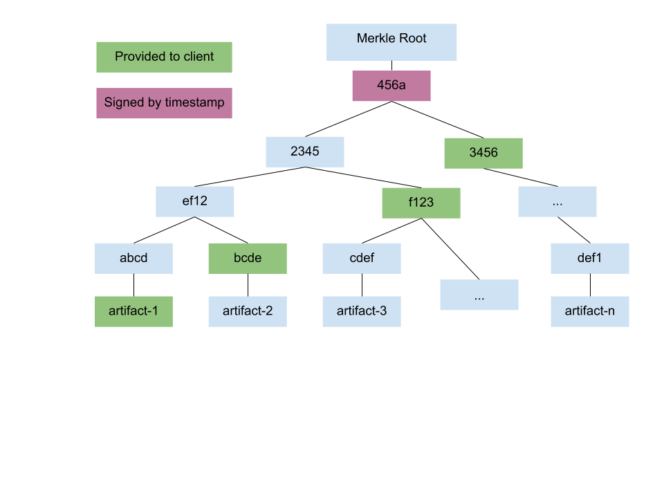

# TUF + Notary v2 Design Overview

Based on discussions over the past few months, we have been designing a variant of TUF for use in Notary v2. This document contains an overview of the workflow and features of this design. The goal of this design is to provide protection against [attacks on update systems](https://theupdateframework.io/security/) transparently to users. This means that most of the features described in this document will be part of automated processes.

## Basic properties

Our design is based on TUF, and so builds onto a specification and implementation that has been used in the real world by PyPI, Google Fuschia, AWS, and more. TUF has support for integration with in-toto for complete supply chain security and has been subjected to multiple security audits. However, Notary requires a few additional considerations to address registry-specific use cases. Specifically, this design addresses the following use cases:
* Air-gapped environments: Clients who receive metadata after a delay will still be able to correctly verify this metadata, with minimal changes to their security guarantees.
* Ephemeral clients: Clients cannot rely on existing state for security properties. Ephemeral clients receive some initialization data, but we want to minimize the overhead for creating ephemeral clients. To do so, we assume ephemeral obtain root private keys through a secure distribution method (like spiffe/spire), but they have no other initial state.
* Allowing users more control over key management: Users may not want to trust the registry for all key management. To address this, we introduce a new feature that allows  a user to use TUF verification while maintaining control of key management.
* Balancing the needs of private and public registries: Our design aims to balance the needs of clients with private images with the needs of large, open source registries by providing some choices to registry operators.
* Scalability: Registries often contain many more images than existing TUF implementations. We calculated metadata overheads for our new variant of TUF, and added some additional scalability options to ensure usability.

## Design

Our design uses the roles from TUF. Each role is associated with metadata that is signed with cryptographic keys associated with the role. Roles may have any number of cryptographic keys, and may require a threshold of signatures. The roles are:
* The root role is the root of trust for the registry. It delegates to the other registry and repository controlled roles. Clients should be given the root public key at set up.
* The snapshot role ensures that all metadata on the registry is current. This current metadata may point to older images (for example if both 1.0.9 and 1.1.0 are currently available), but the metadata itself must not be replayed (for example to a previous version that listed 1.0.9, but not 1.1.0).
* The timestamp role ensures timeliness of all metadata by listing a hash of the current snapshot metadata with the current timestamp. Clients can ensure that this timestamp is within a given window.
* The targets role provides delegations to other targets roles and/or information about an image, including a cryptographic hash and space for metadata about the supply chain (in-toto metadata, SBOM, etc). There may be many targets roles on a registry. At a minimum, we expect:
    * The registry’s top level targets role delegates responsibility for images to repositories on that registry.
    * A repository’s top level targets role may contain images, or further delegations to teams or developers. We recommend multiple layers of delegation to prevent key sharing within an organization, but the exact layout is not prescribed. Delegations may use the ‘AND’ relationship to require that multiple parties agree on image contents.
Using these roles, organizations can formalize their internal processes. For example, if images must be verified by both a developer team and a security team, the organization’s top level targets metadata can delegate all images to dev AND security.

### Using Multiple Signatures

Users may want to verify that multiple parties have signed an image (per scenario #6 in the [requirements](https://github.com/notaryproject/requirements/blob/main/scenarios.md)). This may be to ensure that multiple teams have verified it (for example security and development teams), or that it has been approved by both the originator and an external company. Our design supports this use case through the use of [multi-role delegations](https://github.com/theupdateframework/taps/blob/master/tap3.md).

Multi-role delegations allow an organization to delegate to a combination of roles, and require that these roles agree on the contents of an image. So, company A could delegate to security and development for packages, and these packages would be used only if both teams agreed on the image contents. This mechanism could be used for signatures that have been copied from another registry to ensure that the previous signatory, and the copier have both signed the image.

### Client Customizations

For some client use cases, slight modifications are needed to the above workflow. These modifications do not affect metadata or images on the registry, but allow clients greater flexibility when interacting with the system.

#### TAP 13: Client-side Selection of the Top-Level Target Files Through Mapping Metadata

In some cases, clients may not want to trust all images on a registry, or they may want multiple parties on a registry to agree on an image. To support these use cases, we introduce a new feature that allows a user to overwrite the registry’s top level targets metadata with another metadata file on the registry. This feature is described in detail in [TAP 13](https://github.com/theupdateframework/taps/pull/118), but in essence it continues to use the TUF client workflow, but replaces the targets metadata listed in root (the registry top level targets metadata) with a client defined metadata file. Because the user defines a targets metadata file on the registry, they maintain protection from the timestamp and snapshot roles.

#### Timestamp verification for air-gapped environments

Client systems that are not internet connected may receive metadata after a delay, and so will detect timestamp metadata as invalid. For these clients, we recommend that they either:
* Set a wider window for the valid time (ie a couple of days), and allow any metadata that is valid within that window.
* If that is not possible, they can keep track of the last timestamp they verified, and ensure that the new timestamp is more recent. This provides a weaker guarantee than ensuring that the time is current, but it allows a longer delay in receiving metadata.
These mitigations weaken some of the security guarantees of TUF, but this can be partly mitigated by having the transferring party (the party that gives the metadata to the offline device) perform TUF verification before passing the metadata to the non-connected device.

### Using multiple registries

#### Image movement within/between registries

An image may be moved between registries. To do so, the image index, and it’s associated targets metadata (unchanged) can be directly copied. Once copied, the relevant targets metadata on the new registry (ie the registry top level targets metadata or a repository metadata file) should add a delegation to the image. The registry’s snapshot metadata will need to update to include the new targets metadata. Changes to snapshot metadata may be batched, and should be automated. Timestamp metadata will already update periodically, so will automatically account for the new image.

If images are frequently moved, the registry may maintain a target metadata file with an online key to automate these transfers. The registry’s top level targets metadata can delegate to this online role, which can then delegate to new metadata without any human interaction. The decision whether to use offline or online keys for each targets metadata file is a tradeoff between automation and security, and may vary between registries.

Images can be moved within a registry using a similar process. Aside from the delegation, all steps in this movement can be fully automated and transparent to developers.

##### Namespaces and changing tags

When an image is moved to a new registry, the tag may be changed to reflect the new namespace. If the tag is updated, targets metadata from the previous registry will no longer exactly match targets metadata on the new registry. For example, `wabbitnetworks.example.com/networking/net-monitor:1.0` may be renamed `acmerockets.example.com/net-monitor:1.0` when it is moved to the ACME Rockets registry.

To address this without losing targets metadata from prior to the movement to a new registry, the client could specify that only the last part of the name must match. With this option, the client will verify that all other metadata about the image (including the secure hash) is identical between the different targets metadata files, but the tags may contain different namespaces.

#### Hiding images from other users

In order to keep images isolated from other users of the registry, users can use [repository mapping metadata](https://github.com/theupdateframework/taps/blob/master/tap4.md). Developers can store private images on a separate registry (even if this registry is located on the same server), then users could use the map file to point to the private registry for specific images, and to a public registry for other images. The user would still need to provide credentials to the private registry so that the registry can enforce access control.

### Scalability

For registries that contain a lot of images, we present some optimizations that may help with scalability.

#### Snapshot Merkle Trees

The snapshot metadata file contains the name and version number of every metadata file on the registry. If there are a lot of metadata files (or if metadata filenames present a privacy concern), a registry may choose to instead use a snapshot merkle tree. Each metadata file is a leaf of the merkle tree, and client systems can use the root hash (signed by timestamp metadata) to ensure that a metadata file is contained in the current merkle tree. During this process, they only see secure hashes of other leaves in the tree. In this way, the merkle tree provides a distributed snapshot metadata file that requires the user to download less data and does not reveal any information about images the user is not authorized to view. More detail about this mechanism, and an analysis of the bandwidth savings is available in the [TAP](https://github.com/theupdateframework/taps/pull/125).

## Further Reading

For more information about the design described in this document, please refer to the corresponding TUF documentation. Note that in TUF a ‘repository’ refers to the server on which images are hosted, this maps to a ‘registry’ in Notary.
* [The TUF specification](https://github.com/theupdateframework/specification/blob/master/tuf-spec.md)
* [TAP 13](https://github.com/theupdateframework/taps/pull/118)
* [TAP 15 (Succinct hashed bin delegations)](https://github.com/theupdateframework/taps/blob/master/tap15.md)
* [Snapshot Merkle Trees](https://github.com/theupdateframework/taps/pull/125)
* [Multiple repositories/registries](https://github.com/theupdateframework/taps/blob/master/tap4.md)
